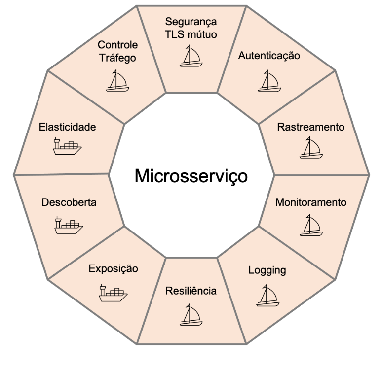

A aplicação simul-shop é um simulador de loja online.

Inspirado no micro-sock, desenvolvida pela [weaveworks](https://www.weave.works/) e [distribuída](https://github.com/microservices-demo/microservices-demo/tree/master) de forma gratuíta (licença [Apache License, Version 2.0](https://www.apache.org/licenses/LICENSE-2.0)) para demonstrar seu produto [Waeve Scope](https://www.weave.works/oss/scope/).

O simulador foi construída usando [Python](https://www.python.org/) e é empacotado uma imagem Docker e entregue em um cluster de kubernetes.

## Simul Shop implementação

Simul-shop adota o [estilo arquitetural de microsserviços](https://microservices.io/), isso implica em ter seus componentes espalhados na rede em uma arquitetura de computação distribuída, onde cada serviço pode ser mantido, entregue e escalado de forma independente.

Essa arquitetura leva as seguintes considerações, muitas vezes tidas como verdadeiras:

* A rede é confiável
* Latência é zero
* Banda de rede é infinita
* Topologia da rede não muda
* Há apenas um administrador
* Camada de transporte tem custo zero
* A rede é homogênea

Sabemos que nada disso é verdadeiro, e ao distribuirmos nosso processamento, todas essas questões vem a tona, inclusive a própria nossa de aplicação, antes facilmente reconhecida nos monolíticos, agora evapora-se com os processos independentes.

Essa é uma das principais funções do Istio, reconcilar a visão de aplicação e fornecer visibiliade e controle das comunicações dos serviços distribuídos (malha de serviços).


Capacidades dos microsserviços atendidas pelo Kubernetes e Istio

Neste curso, usamos um simulador de serviços, que não tem uma interface web e é apenas um programa em python que recebe requisições e invoca outras URLs com base nos parâmetros passados por variável de ambiente.

Como nosso objetivo não são os microsserviços, essa abordagem simplifica a criação da malha e poupa recursos do _cluster_.

Você pode criar malhas diferentes configurando o simulador, por exemplo, vamos simular uma aplicação que tem apenas um front-end e um backend e usaremos o docker para executá-la.


```
# Create net
docker network create my-net

# backend
docker run -d --rm \
--hostname backend \
--network my-net \
--name backend \
-e SCHED_CALL_URL_LST=http://localhost:8000/healthz \
-e SCHED_CALL_INTERVAL=5 \
kdop/generic-service:0.0.5

# front-end
docker run -d --rm \
    --network my-net \
    --hostname front-end \
    --name front-end \
    -e SCHED_CALL_URL_LST=http://front-end:8000/s \
    -e SCHED_CALL_INTERVAL=10 \
    -e SPLIT_CALL_URL_LST=http://backend:8000 \
    kdop/generic-service:0.0.5
```{{execute}}

Vamos acompanhar os _logs_ para ver o que está acontecento. Abra duas abas de terminais e entre com os comandos abaixo em cada um deles:

Terminal 1

`docker logs -f front-end`{{execute T1}}

Terminal 2

`docker logs -f backend`{{execute T2}}

> Alterne entre os terminais para ver os logs.

Agora que conhecemos como configurar e acompanhar nossa aplicação, vamos ir para algo mais complexo.

Vamos remover os recursos criados:

Parando o log nos terminais 1 e 2 com <kbd>CTRL</kbd>+<kbd>C</kbd>.

Parando e excluindo os contêineres:

`docker kill front-end backend`{{execute}}

Removendo os recursos:

`docker network rm my-net`{{execute}}

### Istio + Simul Shop

Neste curso criaremos uma malha mais complexa, iremos configurar o simul-shop com a seguinte arquittura:


E usaremos essa malha para explorar os recursos do Istio.

## Instalando a aplicação

Você já têm os arquivos do curso, nesta lição iremos instalá-los no nosso cluster.

`ls -la assets/exemplos/simul-shop/manifests/4`{{execute}}

A configuração para kubernetes compreende apenas dois recursos, o _deployment_ e o _service_ para cada um dos módulos da nossa aplicação, de acordo coma arquitetura da seção anterior.

* `assets/exemplos/simul-shop/manifests/4/deployments.yaml`{{open}}
* `assets/exemplos/simul-shop/manifests/4/services.yaml`{{open}}

Como na aplicação de demo, criamos um deployment para a imagem `kdop/generic-service 0.0.4` e adicionamos rótulos para representar o nome do módulo e versão.

```yaml
labels:
    app: nome-do-modulo
    version: vN
```

Os serviços foram configurados para acessar cada um dos módulos:

```yaml
metadata:
  name: front-end # <--- Cria um DNS com nome nome-modulo.
...
spec:
  type: ClusterIP
  selector:
    app: front-end # <--- E aponta para um POD que tennha o label nome-modulo.
```

Dessa forma os serviços podem ser endereçados na forma http://nome-modulo:porta/. Na nossa arquitetura:

* http://front-end:80000
* http://login:80000
* http://catalogue:80000
* http://orders:80000
* http://shipping:80000
* http://cart:80000
* http://payment:80000
* http://accounts:80000
* http://orders-db:80000
* http://queue:80000
* http://cart-db:80000
* http://accounts-db:80000

Vamos aplicar a configuração no cluster, mas primeiro vamos verificar o acesso ao cluster e o _namespace_ está preparado para o Istio.

```
# verifica se o rótulo de auto injeção do Istio está ativo
kubectl describe ns default

# Caso não esteja, ativá-lo
kubectl label namespace default istio-injection=enabled

# Verificando se os pods do Istio estão em execução (Running)
kubectl get pods -n istio-system
```{{execute}}

Tudo parece OK, temos acesso ao cluster, o `istiod` está em execução e o _namespace_ está com o rótulo `istio-injection=enabled`, agora aplicamos a configuração:

`kubectl apply -f assets/exemplos/simul-shop/manifests/4/`{{execute}}

Vamos verificar o que foi criado:

`kubectl get all`{{execute}}

Dependendo do seu computador a inicialização dos PODs pode demorar um pouco, entre 2 a 5 minutos, você pode repetir o comando algumas vezes para ver a situação dos PODs ou se preferir, execute o comando `watch kubectl get all`{{execute}} para que atualize automaticamente.

Após alguns minutos todos os PODs devem estar na seguinte situação:

```
accounts-6576c98567-276qs     2/2     Running   0          3m14s
accounts-db-c66f6d886-pfx7k   2/2     Running   0          3m14s
cart-755d886f8f-cz62t         2/2     Running   0          3m16s
cart-db-768bd6f7cd-n7mtk      2/2     Running   0          3m15s
catalogue-6ccc68b854-rcb29    2/2     Running   0          3m17s
front-end-5fdddf4dcb-vl8v9    2/2     Running   0          3m17s
login-868764c74b-8znjz        2/2     Running   0          3m17s
orders-77b45cc699-6r6m2       2/2     Running   0          3m17s
orders-db-59f88cf7b-d28rm     2/2     Running   0          3m17s
payment-8c5f4c94d-8vnlx       2/2     Running   0          3m15s
queue-6884748c5d-2qmst        2/2     Running   0          3m16s
shipping-b7b68d8d9-d78p6      2/2     Running   0          3m16s
```

> Se a coluna _Ready_ estiver exibindo 1//1 provavelmente o _namespace_ está sem o rótulo do Istio ou o POD `istiod` no _namespace_ `istio-system` não está em execução. Verifique antes de prosseguir.

Dependendo da quantidade de recursos disponíveis para o cluster de kubernetes o tempo pode variar e alguns PODs podem falhar (CrashBackoff) algumas vezes (RESTARTS > 0).

Para conhecer mais sobre o ciclo de vida de um POD, acesse [Kubernetes - POD Lifecycle](https://kubernetes.io/docs/concepts/workloads/pods/pod-lifecycle/)

Se algum dos seus PODs não alcançar o estágio _Running_ verifique o motivo com o comando `kubectl describe pod -l app=<nome-do-modulo>`, por exemplo:

`kubectl describe pod -l app=front-end`{{execute}}

Se você for direto para o final, verá uma seção _Events_, e uma série de eventos que aconteceram com o seu POD, os últimos eventos indicaram algum tipo de problema, como por exemplo, que não foi possível encontrar um nó para fazer o _deploy_.

`0/1 nodes are available: 1 Insufficient cpu.`

Isso indica que o cluster não têm recursos suficientes.

## Istio proxy

Vamos olhar novamente a descrição do POD front-end que acabamos de executar, você deve ter percebido algo diferente, há muita informação que não configuramos e quando listamos os PODs (`kubectl get pods`{{execute}}) havia uma indicação que 2/2 contêineres estavam prontos (READY), mas nossa aplicação tem apenas um, o segundo contêiner pode ser descoberto procurando no describe a seção `Containers:`.

Neste _describe_ encontramos dois _containers_:

```bash
# no início da seção
Containers:
  front-end:
    Container ID:   docker://0640db5071daddccdb883410508475cf1f6c447dabc1a841b60a8a1de74683d3
    Image:          kdop/generic-service:0.0.5
# mais abaixo
  istio-proxy:
    Container ID:  docker://9859fd6e75d4cdf9ea7f26be9e3f8fc47a6cf79664d400b87259652113792a30
    Image:         docker.io/istio/proxyv2:1.8.1
```

Um dos contêineres utiliza a imagem da nossa aplicação e o outro do proxy do Istio. Esse contêiner foi adicionado automaticamente pelo `istiod` quando instalamos nossa aplicação no _namespace_ `default`, porque esse _namespace_ está com um rótulo (`istio-injection=enabled`) que indica para o `istiod` executar essa operação de injeção de um _sidecar_ no nosso POD.

`kubectl describe ns default`{{execute}}

## Conclusão

Fizemos o deploy de uma aplicação de demostração que representa uma malha de serviços e vimos o Istio adicionar seu _proxy_ em cada um dos nossos _deployments_.

Se você acompanhar o gráfico no kiali verá a malha se formando, conforme os PODs inicializam e as requisições são disparadas.

> Alguns erros são comuns durante a inicialização e o kiali irá indicá-los. Aguarde alguns minutos até os PODs estarem todos em execução.

Na próxima seção discutiremos brevemente o padrão _sidecar_ utilizado pelo Istio, para saber sobre outros padrões, acesse o curso [Kubernetes avançado para iniciantes].
