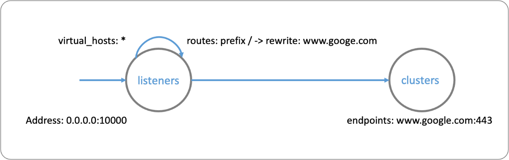

O POD é o recurso gerenciável mais básico no kubernetes, é um grupo de um ou mais containers que compartilham  [armazenamento](https://kubernetes.io/docs/concepts/workloads/pods/#pod-storage) e [recursos de rede](https://kubernetes.io/docs/concepts/workloads/pods/#pod-networking), bem como a especificação de como executá-los.

O caso mais comum é um container por POD, o do aplicativo, mas existem outros, como o sidecar implementado pelo  Istio. Você pode conhecer mais sobre esses padrões na postagem [The Distributed System ToolKit: Patterns for Composite Containers](https://kubernetes.io/blog/2015/06/the-distributed-system-toolkit-patterns/) de Brendan Burns, um dos criadores do kubernetes.

Um caso especial, presente na API do kubernetes é o [container de inicialização](https://kubernetes.io/docs/concepts/workloads/pods/init-containers/), ele é um ou mais containers executados antes do container da aplicação com objetivo de preparar o ambiente, a execução é em seríe e de cada container de inicialização deve terminar para que o container da aplicação seja iniciado.

Você poderia utiliza-lo, por exemplo, para baixar ou clonar um repositório com a configuração necessária para sua aplicação.

Voltando ao Istio, ele utiliza o padrão _sidecar_, o istio-proxy, seu objetivo é aprimorar sua aplicação adicionando funcionalidades de controle de tráfego, monitoramento e segurança, sem precisar modificar sua aplicação, pelo menos não muito, voltaremos a esse problema quando discutirmos rastreamento de logs.

O Istio não cunhou o termon sidecar ou criou a implementação, em vez disso ele usa o [Envoy](https://istio.io/latest/docs/ops/deployment/architecture/) no plano de dados e gerencia esses containers através do plano de controle, o Istiod.

Para enteder mais sobre o istio-proxy precisamos conhecer melhor o Envoy, ele é um proxy com objetivo de tornar a rede transparente para os aplicativos e facilitar a localização de problemas nestas redes.

Suas principais caracteristicas são:

* **Processo independente**: o Envoy é um servidor independente de alto desempenho e leve, projetado para ser executado em conjunto com os servidores de aplicativos, independente da linguagem de programação.
* **Suporte para HTTP1, HTTP2 E GRPC** - O Envoy tem suporte a HTTP / 2 e gRPC para conexões de entrada e de saída. Ele é um proxy de rede com filtros para várias tarefas, como proxy TCP, proxy UDP, proxy HTTP, autenticação de certificado de cliente TLS e protocolos gRPC, Redis, MongoDB, DynamoDB e Postgres.
* **Balanceador de carga avançado** - O Envoy suporta recursos avançados de balanceamento de carga, incluindo retentativas automáticas, interrupção de circuito, controle de limites, duplicação de solicitações, etc.
* **APIs para gerenciamento das configurações** - O Envoy fornece APIs robustas para gerenciar dinamicamente sua configuração.
* **Observabilidade** - Observabilidade do tráfego L7, suporte nativo para rastreamento distribuído e observabilidade dos protocolos gRPC, MongoDB, DynamoDB, Redis e Postgres, até o momento.

## Executando o envoy

Vamos executar um envoy, há duas formas de fazer isso, [instalando o binário do envoy](https://www.envoyproxy.io/docs/envoy/latest/start/install) na sua máquina ou através de uma imagem docker, vamos na segunda opção.


```
docker run --rm -d \
    --name envoy \
    -v $PWD/exemplos/5_envoy/envoy-demo.yaml:/envoy-demo.yaml \
    -p 9901:9901 -p 10000:10000 \
    envoyproxy/envoy-dev:1aa90808abe2531dd50bebdac0408da6f9f53da4 -c /envoy-demo.yaml
```{{execute}}

Acessando o proxy

`curl -v localhost:10000`{{execute}}

Acessando a interface administrativa

`curl -v localhost:9901`{{execute}}

Parando o envoy

`docker kill envoy`{{execute}}

## Entendendo a configuração

Configurar o envoy não é uma tarefa simples, há centenas de parâmetros, o Istio simplifica a configuração fazendo a maior parte do trabalho pesado, nas seções futuras iremos dicutir como realizar avaliações de problemas na configuração do Istio ([Debugging Envoy and Istiod](https://istio.io/latest/docs/ops/diagnostic-tools/proxy-cmd/)).

Por enquanto vamos entender a configuração que utilizamos para demo.



[envoy-demo.yaml](exemplos/5_envoy/envoy-demo.yaml)

A configuração mais simples são as estática (static_resources), nela os recursos são declarados na configuração em oposição a dinâmica (dynamic_resources) onde eles são descobertos. Os principais elementos deste tipo de configuração são `listeners` e `clusters`. 
Na seção `listeners` são configurados os _frontends_ e na seção `clusters` os _backends_.

```yaml
static_resources:

  listeners:
    - name: listener_0
      address:
        socket_address: { address: 0.0.0.0, port_value: 10000 }
      filter_chains:
        - filters:
            - name: envoy.filters.network.http_connection_manager
              typed_config:
                "@type": type.googleapis.com/envoy.extensions.filters.network.http_connection_manager.v3.HttpConnectionManager
                stat_prefix: ingress_http
                codec_type: AUTO
                route_config:
                  name: local_route
                  virtual_hosts:
                    - name: local_service
                      domains: ["*"]
                      routes:
                        - match: { prefix: "/" }
                          route: { host_rewrite_literal: www.google.com, cluster: service_google }
                http_filters:
                  - name: envoy.filters.http.router

  clusters:
    - name: service_google
      connect_timeout: 0.25s
      type: LOGICAL_DNS
      # Comment out the following line to test on v6 networks
      dns_lookup_family: V4_ONLY
      lb_policy: ROUND_ROBIN
      load_assignment:
        cluster_name: service_google
        endpoints:
          - lb_endpoints:
              - endpoint:
                  address:
                    socket_address:
                      address: www.google.com
                      port_value: 443
      transport_socket:
        name: envoy.transport_sockets.tls
        typed_config:
          "@type": type.googleapis.com/envoy.extensions.transport_sockets.tls.v3.UpstreamTlsContext
          sni: www.google.com

admin:
  access_log_path: /tmp/admin_access.log
  address:
    socket_address: { address: 0.0.0.0, port_value: 9901 }
````

Neste exemplo configuramos o _proxy_ para redirecioanr as chamadas para http://localhost:10000 e encaminhá-las para https://www.google.com, um serviço externo a sua malha, mas poderia ser um serviço interno.

### listeners
Declaram uma ou mais portas que ouvirão as requisições para os `clusters`. O endereço é um primeiro filtro, limitando as origens que podem acessar esse `listener`.
Cada `listener` pode ter um ou mais filtros e cada filtro com suas rotas específicas. Nesse exemplo, há apenas um filtro do tipo [HttpConnectionManager](https://www.envoyproxy.io/docs/envoy/latest/api-v2/config/filter/network/http_connection_manager/v2/http_connection_manager.proto).

### routes
Especificam quais informações da requisição http devem ser comparadas, neste exemplo, domínio e caminho e determina qual o `cluster` que receberá essa requisição e opcionalmente a modifica (Ex: _rewrite_).

### clusters
Os clusters são as especificações dos serviços para os quais o Envoy direciona o tráfego.
O “Connect_timeout” é o tempo limite tempo para obter uma conexão com o serviço antes de retornar um 503.
Normalmente, haverá mais de uma instância do serviço e o envoy oferece suporte a vários algoritmos de balanceamento de carga para rotear o tráfego. Neste exemplo o algoritmos de balanceamento é _round robin_.

### endpoints
São os endereços de destino, como podemos observar, os `listeners` não se conectam diretamente com os `endpoints`, oo invés, se conectam com o `cluster` que faz o balanceamento para os `endpoints`.

### admin
A seção `admin` configuram o servidor admin que pode ser usado para visualizar configurações, alterar níveis de registro, visualizar estatísticas, etc.

## Conclusão

Envoy não é o objetivo do curso, mas é importante você entender que o Istio simplifica o seu uso, convertendo suas configurações para configurações do Envoy, no entanto, haverá casos em que você necessitará inspecionar ou ajustar esas configurações e/ou utilizar o Envoy diretamente em seus projetos, então para aprender mais sobre Envoy faça os cursos oficiais [Envoy Proxy, an Open Source Edge and Service Proxy](https://www.katacoda.com/envoyproxy).
