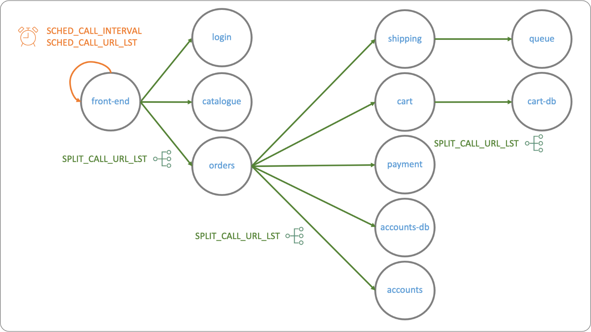
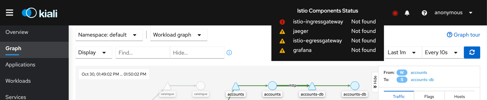
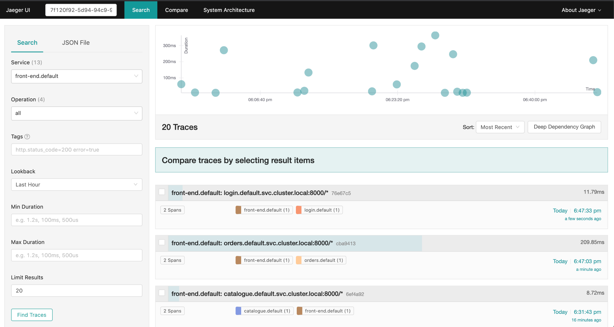

Entre as funcionalidades do Istio a telemetria é que materealiza a malha de serviços, ela fornece visibilidade e rastreamento das relações e comunicações na malha.

O interessante é que você obtem a maior parte das funcionalidades gratuitamente por ter instalado o istio-proxy ao lado da sua aplicação, nenhuma configuração adicional será necessária para as funções que iremos explorar. Nas seções seguintes veremos o rastreamento de logs e é a única funcionalidade que necessitará de algumas modificações na nossa aplicação.

## Kiali

Já tivemos contato com o Kiali, agora vamos adicionar as demais ferramentas que completam o conjunto básico de funcionalidades de telemetria, o Jaeger e o Grafana.

Mas antes, vamos voltar ao kiali para explorar em profundidade suas funcionalidades.

Para executá-lo:

Versão do Istio

`ISTIO_VERSION=1.9.2`{{execute}}

Se necessário, configure o acesso ao cluster

`export KUBECONFIG=~/.kube/config`{{execute}}

Se ainda não estiver em execução, para verificar, no terminal: ps -ef | grep "istioctl dashboard kiali"

`istioctl dashboard kiali --address 0.0.0.0 &`{{execute}}

`export KIALI_PID=$!`{{execute}}

Abra no navegador a url <https://[[HOST_SUBDOMAIN]]-20001-[[KATACODA_HOST]].environments.katacoda.com>


A aplicação simul-shop é composta por vários PODs, compare o gráfico do kiali com o gráfico da seção 04.



A grande diferença é que o gráfico exibido pelo kiali está sendo criado com base no uso da aplicação e é muito mais confiável do que a documentação que pode estar desatualizada ou não representar mais a realidade.

> Tipos de leiaute: Há três opções de organização do gráfico para os gráficos do kiali, o padrão - dagre, o 1 - cose bikent e o 2 - cola. A escolha é mais uma opção de estética, mas para conhecer mais sobre os tipos acesse [Cytoscape - Layout extensions](https://js.cytoscape.org/#extensions/layout-extensions).

[Opcional] Parando o redirecionamento para o dashboard do kiali

`kill $KIALI_PID`{{execute}}

## Rastreamento de logs com Jaeger

O Rastreamento Distribuído de logs trata de compreender o caminho dos dados à medida que se propagam pelos componentes de nosso aplicativo. Embora os Logs possam registrar pontos de verificação importantes ao atender a uma solicitação, um Rastreamento conecta todos esses pontos de verificação em uma rota completa que explica como essa solicitação foi tratada em todos os serviços do início ao fim.

O Istio aproveita o recurso de [rastreamento distribuído do Envoy](https://www.envoyproxy.io/docs/envoy/v1.12.0/intro/arch_overview/observability/tracing) para fornecer integração de rastreamento pronta para uso. Especificamente, o Istio oferece opções para instalar vários _back-ends_ de rastreamento e configurar proxies para enviar _spans_ de rastreamento para eles automaticamente. O Istio traz integrações com [Zipkin](https://istio.io/latest/docs/tasks/observability/distributed-tracing/zipkin/), [Jaeger](https://istio.io/latest/docs/tasks/observability/distributed-tracing/jaeger/) e [Lightstep](Lightstep). 

O rastreamento também está integrado com o Kiali, você deve ter percebido algumas mensagens de erro quando tentavamos acessar funcionalidades de rastreamento.


De fato, o Kiali tem um indicador que verifica se os componentes do Istio, Jaeger e Grafana estão instalados,



Enão, antes de começarmos a utlizar o Jaeger precisaremos instalá-lo em nosso cluster.

`kubectl apply -f istio-$ISTIO_VERSION/samples/addons/jaeger.yaml`{{execute}}

Vamos verificar a situação do POD do jaeger.

`kubectl get pods -n istio-system`{{execute}}

Para acessar o dashboard vamos continuar utilizando o `istioctl`, como fizemos para o kiali.

`istioctl dashboard jaeger --address 0.0.0.0 &`{{execute}}

`export JAEGER_PID=$!`{{execute}}

Abra no navegador a url <https://[[HOST_SUBDOMAIN]]-16686-[[KATACODA_HOST]].environments.katacoda.com>


* O que é rastreamento? 
* O que é [OpenTelemetry](https://opentelemetry.io/)
* Instalando o Jaeger
* Visão  geral do Jaeger

Podemos para o processo do `istioctl` para economizar recursos.

[Opcional] Parando o redirecionamento para o dashboard do Jaeger

`kill $JAEGER_PID`{{execute}}

## Replicando cabeçalhos para o rastreamento

A telemetria no Istio é não-envasiva, não precisamos modificar o código para obter a maior parte das funcionalidades, porém para que o rastreamento funcione corretamente precisaremos realizar uma modificação, teremos que replicar o cabeçalho de rastreamento.

Sem essa replicação o Jaeger irá exibir o rastrei apenas da primeira requisição, pois será gerado um novo identificador a cada chamada.



Infelizmente esse procedimento é invasivo e depende da linguagem de programação. Na documentação do Istio [Trace context propagation](https://istio.io/latest/docs/tasks/observability/distributed-tracing/overview/#trace-context-propagation) há um exemplo de código python e java.

Caso você tenha algum serviço entre as chamadas, como um API Gateway, você poderá utilizá-lo para replicar os cabeçalhos, que são:

* x-request-id
* x-b3-traceid
* x-b3-spanid
* x-b3-parentspanid
* x-b3-sampled
* x-b3-flags
* x-ot-span-context

Na nossa aplicação de demonstração simul-shop o seguinte código em python foi implementado:

```python
from fastapi import FastAPI, Request
from fastapi_opentracing import get_opentracing_span_headers
from fastapi_opentracing.middleware import OpenTracingMiddleware

# App
app = FastAPI()
app.add_middleware(OpenTracingMiddleware)

# service call
def invoke_ws_list(url_list: list, headers = {}):
    logging.debug('Invoked')
    logging.info(f'Calling: {url_list}')
    for url in url_list:
        if url:
            try:
                response = requests.get(url, headers=headers) # <------- Repassa o cabeçalho
                logging.info(f"headers: {response.headers}")
                logging.info(f"body: {response.content}")
            except Exception as err:
                logging.error(f"Failed reaching {url} - {err}")

# Split
@app.get("/s", response_model=MessageOut)
async def split(request: Request):
    carrier = await get_opentracing_span_headers() # <------ Obtem o cabeçalho
    logging.info(f"opentracing: {carrier}")
    logging.info(f"request.headers: {request.headers}")
    url_list = SPLIT_CALL_URL_LST.split(",")
    message = MessageOut(name="split", description=f"List {url_list}")
    invoke_ws_list(url_list, carrier) # <-------- Repassa o cabeçalho
    return message
```

> Código completo está em [assets/exemplos/generic-service/py/app/main.py](./assets/exemplos/generic-service/py/app/main.py)

Usando a biblioteca [fastapi_opentracing](https://github.com/wesdu/fastapi-opentracing), obtemos o cabeçalho de rastreamento e o adicionamos no request para o próximo serviço, dessa forma mantêmos a relação entre as requisições.

```log
2020-10-30T21:59:23.841055200Z INFO: 2020-10-30 21:59:23,836 - request.headers: Headers({'host': 'front-end:8000', 'user-agent': 'python-requests/2.24.0', 'accept-encoding': 'gzip, deflate', 'accept': '*/*', 'x-forwarded-proto': 'http', 'x-request-id': '48e17601-e34a-4cc8-b47d-74f666943d14', 'x-envoy-attempt-count': '1', 'content-length': '0', 'x-forwarded-client-cert': 'By=spiffe://cluster.local/ns/default/sa/default;Hash=549a0e87f1c4d64d54a3433318fa1b855b5d45f634477411b8ad84912f06120b;Subject="";URI=spiffe://cluster.local/ns/default/sa/default', 'x-b3-traceid': '5573be4183f426e828c7ecf9e7113264', 'x-b3-spanid': '2449fc64cd15e4eb', 'x-b3-parentspanid': '28c7ecf9e7113264', 'x-b3-sampled': '0'})
```

Exemplo de cabeçalho de rastreamento.

Isso é todo o código que iremos ver para utilizar o Istio, com esse código implementado o nosso rastreamento no Jaeger ficará completo.


E veremos a relação entre as chamadas de serviços.

## Grafana


### Métricas no kiali

Em detalhes de uma aplicação (application), serviço (service) ou carga de trabalho (workload), o Kiali exibe métricas de entrada (inbound) e saída (outbound), essas métricas também são encontradas no Grafana.


Tanto o Grafana quanto o Kiali obtém métricas do mesmo lugar, o Prometheus, mas o Grafana tem mais recursos para exibição, visualização dos dados, linguagem de pesquisa e alertas, o que torna o ambiente perfeito para desenvolver painéis sofisticados para monitorar suas aplicações.

O Grafana trás outra vantagem, permitie adicionar outras fontes de dados, sendo que o kubernetes é muuito cmunm, dessa forma você pode acompanhar o que acontece com o Istio e o Kuberentes, por exemplo.

## Visão geral

O [Grafana](https://grafana.com/grafana/) é uma plataforma para análise de métricas, onde você obtem as métricas, configurando fontes de dados, realizar pesquisas (PromQL) e configura vizualizações e alertas.

Adotada por muitos projetos, normalmente faz par com o [Prometheus](https://prometheus.io/), que fica encarreado de coletar as métricas.

O Istio, nas versões anteriores trazia o Prometehus e o Grafana como parte da solução, nas versões mais recentes eles são extras que podem ser adicionados a solução, porém já integrados com o Istio.


O Istio instala alguns dashboards:

* **Mesh Dashbaord** - Uma visão de resumo de malha, exibe uma visão de resumo global da malha e mostra as cargas de trabalho HTTP / gRPC e TCP;
* **Service Dashboard** - Visualização de serviços individuais, exibe métricas sobre solicitações e respostas para cada serviço individual na malha;
* **Workload Dashboard** - Visualização de cargas de trabalho individuais, exibe métricas sobre solicitações e respostas para cada carga de trabalho individual dentro da malha.

### Instalando e execuando o Grafana

O dito anteriormente, o Grafana não faz parte da solução, mas pode ser instalado, juntamente com os dashboards do Istio, a partir do download do Istio.

`kubectl apply -f istio-$ISTIO_VERSION/samples/addons/grafana.yaml`{{execute}}

Verifique se o grafana já está em execução

`kubectl get pods -n istio-system`{{execute}}

Vamos configurar o redirecionamento para o dashboard.

`istioctl dashboard grafana --address 0.0.0.0 &`{{execute}}

`export GRAFANA_PID=$!`{{execute}}

Abra no navegador a url <https://[[HOST_SUBDOMAIN]]-3000-[[KATACODA_HOST]].environments.katacoda.com>

[Opcional] Parando o redirecionamento para o dashboard do graphana

`kill $GRAFANA_PID`{{execute}}

## Conclusão

O Istio trás ferramentas poderosas para o monitoramento e diagnóstico, entre elas o Kiali se destaca por tornar concreta a malha de serviços.

Todas as ferramnetas funcionam sem precisar de intervenção no código, com exceção do rastreamento, que necessita que o cabeçalho de rastreamento seja replicado entre as chamadas.

Agora que você conhece as ferramentas, explore seus dados, utilize o Kiali para desenvolver regras complexas de tráfego e copie suas configurações em yaml para suas entregas, rastrei chamadas para identificar gargalos ou problemas no seu código e monitore de forma profissional suas aplicações.

Nas próximas seções entendermos melhor como utilizar o gerenciamento de tráfego do Istio para realizar entregas com baixo risco, testes e muito mais.
