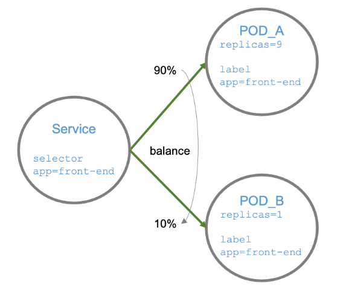
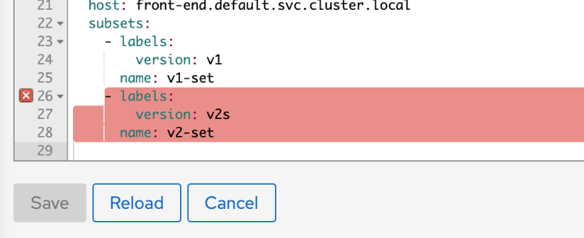

## O que é gerenciamento de tráfego

Gerenciar o tráfego é controlar o fluxo das requisições, tanto as de entrada (ingress), quanto as de saída (egress).

O Istio fornece recursos bastante sofisticados para gerenciar o tráfego, com eles você pode direcionar e controlar o tráfego com base:

* [Criptografar o tráfego (mTLS)](https://istio.io/docs/concepts/security/#authentication-policies)
* [Validar tokens JWT](https://istio.io/docs/concepts/security/#authentication-architecturen)
* [Estabelecer políticas de authorização](https://istio.io/docs/reference/config/security/authorization-policy/)
* [Implantações canário, azul/verde e testes A/B](https://istio.io/docs/concepts/traffic-management/#routing-versions)
* [Direcionar com base nos valores no HTTP headers, FQDN e caminho](https://istio.io/docs/concepts/traffic-management/#match-request-uri)
* [Simulação de erros e atrasos](https://istio.io/docs/concepts/traffic-management/#fault-injection)
* [Retentativas e _timeouts_](https://istio.io/docs/concepts/traffic-management/#set-number-and-timeouts-for-retries)
* [Espelhar o tráfego](https://istio.io/latest/docs/tasks/traffic-management/mirroring/)
* [Balanceamento de carga](https://istio.io/latest/docs/concepts/traffic-management/#load-balancing-options)
* [Acessar serviços de fora do cluster](https://istio.io/docs/concepts/traffic-management/#service-entries)
* [Modificar cabeçalho de resposta](https://istio.io/docs/reference/config/networking/v1alpha3/virtual-service/#Headers)

Vamos começar com um exemplo prático, mas que é base para vários cenários.

## Implantações canário ou lançamento em etapas


> Não é necessário criar uma configuração de `VirtualService` para cada um dos seus serviços, vimos que com a injeção do _proxy_, os rótulos _app_ e _version_ e a replicação do cabeçalho de rastreio, você já terá a maioria das funcionalidades de monitoramento e rastreio, mesmo para liberação canário, após comutar 100% do tráfego para a nova versão, você poderá excluir o VS e deixar o tráfego sendo gerenciado pelo k8s.

Uma implantação canário é uma estratégia para lançar com segurança uma nova versão de um serviço, onde gradualmente uma nova versão é disponibilizada para um número cada vez maior de usuários.

Essa estratégia permite minimizar os danos em caso de problemas e ao mesmo tempo realizar os testes finais no ambiente real. Com o serviço disponível para um número pequeno de usuários, os desenvolvedores e operações tem change de acompanhar seu comportamento sem afetar toda a base de usuários e a reversão da implantação é apenas uma configuração.

Dessa forma é possível manter a dupla convivência de serviços por períodos mais prolongados e avaliar os efeitos colaterias com maior profundidade.

> Você poderá encontrar em algumas literaturas os termos para [padrão de tráfego norte-sul e leste-oeste](https://blogs.cisco.com/security/trends-in-data-center-security-part-1-traffic-trends). Simplificando, o tráfego norte-sul é o tráfego de servidor para cliente, enquanto leste-oeste é o tráfego de servidor para servidor.

### Implementação somente com kubernetes usando replicas

É possível implementar de uma forma rudimentar essa estratégia utilizando apenas o serviço do kubernetes.

Um serviço pode selecionar vários PODs, dependendo apenas de como configuramos o seletor. Se lançarmos uma nova versão em um segundo _deployment_ com o mesmo rótulo usado como seletor, o serviço irá "balancear" as requisições entre os PODs.

O balanceamento é feito pelo kube-proxy e dependendo do [modo que ele foi configurado](https://kubernetes.io/docs/concepts/services-networking/service/#virtual-ips-and-service-proxies), o resultado pode ser melhor, por exemplo, de qualquer forma, para alcançar um balanceamento de dez porcento para a versão dois, seria necessário nove PODs (réplica) da versão um e um POD da versão dois, já deu para perceber o que acontece se a distribuição for um para noventa e nove.



> Rótulo `app` tem se tornado um padrão e é reconhecido pelo kiali para agrupar cargas de trabalho. `version` também tem significado especial para kiali e é usado no gráfico de versões.

Vamos fazer um teste simples, vamos criar um novo _deployment_ com uma nova versão do front-end.

`kubectl apply -f exemplos/simul-shop/manifests/8/front-end-deployment-v2.yaml`{{execute}}

Depois de algum tempo, o Kiali irá exibir uma gráfico de versão como o abaixo:


> Nossa aplicação front-end tem um agendador que chama a si próprio a cada intervalo de tempo para criar tráfego. Você pode verificar isso pelas setas de tráfego.

Agora vamos testar o balanceamento, lembrando que svc/front-end tem como seletor o rótulo app=frotn-end, o mesmo rótulo nas versões um e dois.

Verificando o serviço

`kubectl describe svc/front-end`{{execute}}

Nós temos um problema com essa abordagem, nosso serviço é do tipo `ClusterIP` e não podemos chamá-lo de fora do cluster, como alternativa, poderíamos utilizar o `kubectl port-forward`, mas o balanceamento não funcionaria, uma outra alternativa é testar de dentro de um dos containêres de outro POD.

Execute esse comando em um terminal, copie o comando abaixo, vá ao menul lateral, click em <kbd>+</kbd> e selecione um terminal.

`kubectl exec -it svc/login -c login -- bash`{{execute}}

Você deverá ver um prompt, cole ou digite o comando:

`root@login-76d5c494d7-nw2pq:/app# `

> **Dica pro**: O comando `kubectl port-forward` não utiliza o serviço para conectar no POD, por isso não há balanceamento. O que ele faz é utilizar a informação de quais PODs estão associados ao serviço e estabelecer conexão com um deles, quase sempre o primeiro, mas não há garantias. Por isso, mesmo que seu serviço selecione dois PODs ou mais (rótulo de seleção) você não terá nenhum balanceamento utilizando o `port-forward`, cuja a finalidade é depuração e testes.

Agora que estamos dentro de um container, vamos executar o script bash simplesmente copiando seu conteúdo e colando no terminal.

[scripts/call.sh](scripts/call.sh)

você deve ter um retorno semelhante a este:

```bash
{"name":"greetings","description":"Hi there!","app":"front-end","version":"v2","when":"2020-11-04 21:30:15"}
{"name":"greetings","description":"Hi there!","app":"front-end","version":"v1","when":"2020-11-04 21:30:16"}
{"name":"greetings","description":"Hi there!","app":"front-end","version":"v2","when":"2020-11-04 21:30:17"}
{"name":"greetings","description":"Hi there!","app":"front-end","version":"v2","when":"2020-11-04 21:30:18"}
{"name":"greetings","description":"Hi there!","app":"front-end","version":"v1","when":"2020-11-04 21:30:19"}
{"name":"greetings","description":"Hi there!","app":"front-end","version":"v1","when":"2020-11-04 21:30:20"}
```

Ótimo, o nome front-end foi reconhecido e o serviço aparentemete está fazendo _round robin_, chamando de forma alternada as versões um e dois. O balanceamento não é perfeito, mas depois de algum tempo em execução a média deverá ser 50% v1 e 50% v2.

Como discutimos, para mudar essa relação basta adicionar réplicas, mas não faremos isso pois consumiria mais recursos do cluster.

Se você executar um `nslookup front-end` verá o endereço do kube-dns (Server) que resolveu o nome front-end, o endereço ip do front-end (Address) e o nome qualificado do dominio (Name) que é front-end.default.svc.cluster.local.

Mantenha essa conexão, iremos acessar esse container algumas vezes.

> Caso o consumo de recurso esteja elevado, você poderá desligar a auto-chamada do front-end. Aplique uma nova configuração para o _deployment_ [exemplos/simul-shop-/manifests/8/front-end-deployment-no-auto.yaml](exemplos/simul-shop-/manifests/8/front-end-deployment-no-auto.yaml), que retira a variável de ambiente `SCHED_CALL_URL_LST`. Isso fará com que o gráfico desapareça depois de algum tempo se você não executar chamadas ao fornt-end, como fizemos acima. Não se preocupe, quando necessário iremos executar o script para geração de carga.

> Execute em um terminal para interromper a auto-chamada do front-end: `kubectl apply -f exemplos/simul-shop-/manifests/8/front-end-deployment-no-auto.yaml`

### Implementação com Istio

Para obter a distribuição de carga precisaremos criar um `VirtualService` e um `DestinationRule`.

Podemos criá-las utilizando o Kiali, como fizemos no vídeo, ou podemos configurar os recursos necessários com arquivos yaml e aplicá-los com o `kubectl apply` ou adicioná-los aos _templates_ do `helm`.

Faremos com arquivos yaml nossa primeira configuração de Istio até agora.

[exemplos/simul-shop/istio/8/front-end-canary-release.yaml](exemplos/simul-shop/istio/8/front-end-canary-release.yaml)

Vamos aplicá-lo.

`kubectl apply -f exemplos/simul-shop/istio/8/front-end-canary-release.yaml`{{execute}}

Foram criados dois recursos do Istio, vamos entender a configuração:

```yaml
kind: VirtualService
apiVersion: networking.istio.io/v1alpha3
metadata:
  name: front-end # Qualquer nome, escolha um que faz sentido para a regra
  namespace: default
spec:
  hosts:
    - front-end.default.svc.cluster.local # O nome do k8s Service. Recomendado FQDN, mas pode ser abreviado se estiver no mesmo namespace do serviço
  http:
    - route:
        - destination:
            host: front-end.default.svc.cluster.local # O endereço alvo. Podem ser diferentes
            subset: v1-set # Mesmo nome definido para o subset no DestinationRule para esse host
          weight: 90 # Em percentual, quantiade aproximada de requisições que vão para o subconjunto v1-set
        - destination:
            host: front-end.default.svc.cluster.local # O endereço alvo. Não precisa ser o mesmo
            subset: v2-set # Mesmo nome definido para o subset no DestinationRule para esse host
          weight: 10 # por cento irá para o subconjunto v2-set
```

E a relação com o `DestinationRule` se dá pelo FQDN do host:

```yaml
# Define quais PODs fazem parte de cada subconjunto (subset)
kind: DestinationRule
apiVersion: networking.istio.io/v1alpha3
metadata:
  name: front-end # Qualquer nome.
  namespace: default
spec:
  host: front-end.default.svc.cluster.local # k8s service name, FQDN ou abriaviado.
  subsets:
    - labels: # Seletor
        version: v1 # PODs do serviço front-end.default.svc.cluster.local com o label version: v1 fazem parte desse subconjunto
      name: v1-set # Qualquer nome, mas que represente o subconjunto.
    - labels: # Seletor
        version: v2 # Da mesma forma, PODs do mesmo serviço (host = k8s service) com o label version: v2 fazem parte desse subconjunto
      name: v2-set # Qualquer nome, mas que represente o subconjunto, nesse caso PODs da versao dois.
```

No kiali podemos ver o indicador , e no menu Istio config as duas configurações.

Podemos realizar um novo teste para verificar o balanceamento. Vá para o terminal e verifique ou execute novamente o script [scripts/call.sh](scripts/call.sh).

Deve ter um resultado semelhante ao do vídeo, aproximadamente noventa porcento das chamadas para v1 e dez por cento para v2. Modifique os valores no arquivo [exemplos/simul-shop/istio/8/front-end-canary-release.yaml](exemplos/simul-shop/istio/8/front-end-canary-release.yaml) , e aplique novamente com `kubectl apply -f exemplos/simul-shop-istio/front-end-canary-release.yaml`

### Usando o Kiali para validar as configurações do Istio

O Kiali além de permitir configurar o Istio, pode ser usado parar validá-lo, vamos causar um erro no _DestinationRule_.

```yaml
---
kind: DestinationRule
apiVersion: networking.istio.io/v1alpha3
metadata:
  name: front-end
  namespace: default
spec:
  host: front-end.default.svc.cluster.local
  subsets:
    - labels:
        version: v1
      name: v1-set
    - labels:
        version: v2s # <---- Erro de digitação
      name: v2-set
```

Vamos aplicá-lo:

`kubectl apply -f exemplos/simul-shop/istio/8/front-end-config-error.yaml`{{execute}}

O kubernetes não reclamou do erro de digitação, vamos verificar o terminal.

Como cometemos um erro no rótulo v2, o erro aparece de forma intermitente.

```bash
{"name":"split","description":"List ['http://login:8000/', 'http://catalogue:8000/', 'http://orders:8000/s']","app":"front-end","version":"v1","when":"2020-11-09 19:23:00"}
{"name":"split","description":"List ['http://login:8000/', 'http://catalogue:8000/', 'http://orders:8000/s']","app":"front-end","version":"v1","when":"2020-11-09 19:23:01"}
{"name":"split","description":"List ['http://login:8000/', 'http://catalogue:8000/', 'http://orders:8000/s']","app":"front-end","version":"v1","when":"2020-11-09 19:23:02"}
{"name":"split","description":"List ['http://login:8000/', 'http://catalogue:8000/', 'http://orders:8000/s']","app":"front-end","version":"v1","when":"2020-11-09 19:23:03"}
{"name":"split","description":"List ['http://login:8000/', 'http://catalogue:8000/', 'http://orders:8000/s']","app":"front-end","version":"v1","when":"2020-11-09 19:23:05"}
no healthy upstream # <---- Erro
```

Vamos ver como o Kiali pode nos ajudar. Selecione a opção Istio Config e imediatamente vemos um indicador de problema.


Ao seleciona o item, o kiali indica que houve falha de validação:


Na parte inferior, há uma representação da configuração, onde verificamos qual o problema.


E ao selecionar a configuração YAML, a seção com problema é destacada.



Poderiamos corrigir o erro no editor, mas vamos executar a configuração novamente:

`kubectl apply -f exemplos/simul-shop/istio/8/front-end-canary-release.yaml`{{execute}}

Volte para kiali na opção _Istio Config_ e agora há um indicador de OK para as duas configurações e o no terminal não exibe mais o erro `no healthy upstream`.

Nas próximas seções continuaremos a explorar mais recursos do gerenciamento de tráfego.
