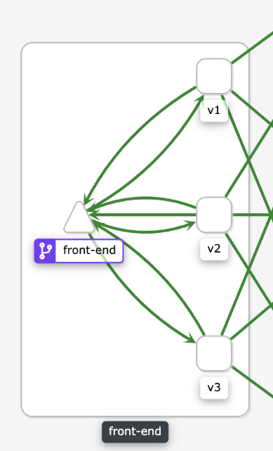

Uma das aplicações no controle de tráfego é o balanceamento de carga, diferente da versão canário, que distribui a carga com base em pesos, o balanceamento de carga tem como objetivo distribuir a carga uniforme, aplicando algum algoritmo.

O Istio tem um grande conjunto de recursos para balanceamento de carga, eles são configurados nas [Destination Rule](https://istio.io/latest/docs/reference/config/networking/destination-rule/), vamos analisar os mais comuns.

## Simples: Round Robin

O mais comum dos algoritmos de balanceamento, simplesmente o algoritmo entrega uma requisição para cada destino saudável (exemplo: que não tenha retornado erro nas últimas cinco requisições). Por padrão, os _proxies_ Envoy distribuem o tráfego usando um modelo _round-robin_.

Para implementálo na nossa aplicação, primeiro removeremos as outras ocnfigurações:

`kubectl delete -f assets/exemplos/simul-shop/istio/8/front-end-canary-release.yaml`{{execute T1}}

Vamos adicionar mais uma versão ao front-end para que vejamos as diferenças entre os algoritmos.

`kubectl apply -f assets/exemplos/simul-shop/manifests/9/front-end-deployment-v3.yaml`{{execute T1}}

Agora vamos aplicar a configuração do arquivo `assets/exemplos/simul-shop/istio/9/front-end-loadbalancer-round-robin.yaml`{{open}}.

`kubectl apply -f assets/exemplos/simul-shop/istio/9/front-end-loadbalancer-round-robin.yaml`{{execute T1}}

Vamos olhar no terminal, se você fechou o script `assets/scripts/call.sh`{{open}} que estavamos executando no container `login`, execute-o novamente.

`kubectl exec -it svc/login -c login -- bash`{{execute T2}} e copie e cole o script.

Você deve obter uma saída semelhante a esta:

```bash
{"name":"split","description":"List ['http://login:8000/', 'http://catalogue:8000/', 'http://orders:8000/s']","app":"front-end","version":"v1","when":"2020-11-09 22:21:31"}
{"name":"split","description":"List ['http://login:8000/', 'http://catalogue:8000/', 'http://orders:8000/s']","app":"front-end","version":"v2","when":"2020-11-09 22:21:32"}
{"name":"split","description":"List ['http://login:8000/', 'http://catalogue:8000/', 'http://orders:8000/s']","app":"front-end","version":"v3","when":"2020-11-09 22:21:33"}
{"name":"split","description":"List ['http://login:8000/', 'http://catalogue:8000/', 'http://orders:8000/s']","app":"front-end","version":"v1","when":"2020-11-09 22:21:34"}
{"name":"split","description":"List ['http://login:8000/', 'http://catalogue:8000/', 'http://orders:8000/s']","app":"front-end","version":"v2","when":"2020-11-09 22:21:35"}
{"name":"split","description":"List ['http://login:8000/', 'http://catalogue:8000/', 'http://orders:8000/s']","app":"front-end","version":"v3","when":"2020-11-09 22:21:37"}
```

E no kiali o gráfico ficará assim:



Como já vimos a distribuição não é precisa, algumas vezes as requisições ficam fora da ordem, mas o Istio fará o melhor esforço para distribuir as requisições e, após um período mais longo, deverá ser de 1/3 para cada serviço.

Agora vamos tentar um algoritmo diferente.

## Simples: Random

Essa configuração (`assets/exemplos/simul-shop/istio/9/front-end-loadbalancer-random.yaml`{{open}}), usa um algoritmo que escolhe aleatoriamente uma das três opções e envia a requisição.

`kubectl apply -f assets/exemplos/simul-shop/istio/9/front-end-loadbalancer-random.yaml`{{execute T1}}

Agora o script `assets/scripts/call.sh`{{open}} deve exibir algo mais aleatório, como isto:

```bash
{"name":"split","description":"List ['http://login:8000/', 'http://catalogue:8000/', 'http://orders:8000/s']","app":"front-end","version":"v3","when":"2020-11-09 22:25:52"}
{"name":"split","description":"List ['http://login:8000/', 'http://catalogue:8000/', 'http://orders:8000/s']","app":"front-end","version":"v2","when":"2020-11-09 22:25:53"}
{"name":"split","description":"List ['http://login:8000/', 'http://catalogue:8000/', 'http://orders:8000/s']","app":"front-end","version":"v2","when":"2020-11-09 22:25:55"}
{"name":"split","description":"List ['http://login:8000/', 'http://catalogue:8000/', 'http://orders:8000/s']","app":"front-end","version":"v1","when":"2020-11-09 22:25:56"}
{"name":"split","description":"List ['http://login:8000/', 'http://catalogue:8000/', 'http://orders:8000/s']","app":"front-end","version":"v1","when":"2020-11-09 22:25:57"}
{"name":"split","description":"List ['http://login:8000/', 'http://catalogue:8000/', 'http://orders:8000/s']","app":"front-end","version":"v3","when":"2020-11-09 22:25:58"}
{"name":"split","description":"List ['http://login:8000/', 'http://catalogue:8000/', 'http://orders:8000/s']","app":"front-end","version":"v3","when":"2020-11-09 22:25:59"}
{"name":"split","description":"List ['http://login:8000/', 'http://catalogue:8000/', 'http://orders:8000/s']","app":"front-end","version":"v2","when":"2020-11-09 22:26:00"}
{"name":"split","description":"List ['http://login:8000/', 'http://catalogue:8000/', 'http://orders:8000/s']","app":"front-end","version":"v1","when":"2020-11-09 22:26:02"}
{"name":"split","description":"List ['http://login:8000/', 'http://catalogue:8000/', 'http://orders:8000/s']","app":"front-end","version":"v1","when":"2020-11-09 22:26:03"}
{"name":"split","description":"List ['http://login:8000/', 'http://catalogue:8000/', 'http://orders:8000/s']","app":"front-end","version":"v3","when":"2020-11-09 22:26:04"}
{"name":"split","description":"List ['http://login:8000/', 'http://catalogue:8000/', 'http://orders:8000/s']","app":"front-end","version":"v1","when":"2020-11-09 22:26:05"}
```

Até o momemnto testamos _RANDOM_ e _ROUND_ROBIN_ proque são as mais fáceis de observar, a mais duas opções: _LEAST_CONN_ e _PASSTHROUGH_. _LEAST_CONN_, seleciona aleatoriamente dois destinos saudáveis e envia a requisição para o destino com menor quantidade de requisições. _PASSTHROUGH_ é uma configuração de passagem, envia a requisição diretamente para o endereço configurado, sem nenhum balanceamento.

Para conhecer quais PODs o Istio irá considerar no balanceamento você pode inspecionar a configurações do Envoy.

`POD=$(kubectl get pod -l "app=front-end,version=v1" --template '{{range .items}}{{.metadata.name}}{{"\n"}}{{end}}')`{{execute T1}}

`istioctl proxy-config endpoints $POD --cluster "outbound|8000|all-pods|front-end.default.svc.cluster.local"`{{execute T1}}

> Você pode consultar qualquer um dos três PODs (v1, v2, v3), todos tem a mesma configuração.

As configurações para o balanceador de carga simples estão em [Destination Rule](https://istio.io/latest/docs/reference/config/networking/destination-rule/)-[LoadBalancerSettings.SimpleLB](LoadBalancerSettings.SimpleLB) e iremos explorar mais algumas nesta seção.

> Para verificar quais as configurações que o Istio fez para o Envoy, acesse o dashboard do envoy com o comando `istioctl dashboard envoy -l "app=front-end"`, selecione o link [config_dump](http://localhost:15000/config_dump) e procure pela _string_ `outbound|8000|all-pods|front-end.default.svc.cluster.local`, próximo você deverá encontrar a configuração `lb_policy`. Verifique para cada nova configuração que fizermos no Istio, o que foi configurado no Envoy. Aproveite para conhecer mais configurações feitas pelo Istio.

## Afinidade de sessão

O Istio prove um tipo de balanceador de carga que utiliza um algoritmo de [hash](https://en.wikipedia.org/wiki/Hash_function) para determinar o destino da requisição, dessa forma, sempre que o mesmo dado for passado para o algoritmo, ele selecionará o mesmo destino.

As opções são:

* **httpHeaderName** - Hash baseado em um cabeçalho HTTP específico.
* **httpCookie** - Hash baseado em cookie HTTP.
* **useSourceIp** - Hash baseado no endereço IP de origem.
* **httpQueryParameterName** - Hash com base em um parâmetro de consulta HTTP específico.

> O Istio irá configurar o envoy com a política de balanceamento `RING_HASH`, para mais informações consulte: [Envoy - Load Balancing](https://www.envoyproxy.io/docs/envoy/latest/intro/arch_overview/upstream/load_balancing/load_balancing)-[Ring hash](https://www.envoyproxy.io/docs/envoy/latest/intro/arch_overview/upstream/load_balancing/load_balancers.html?highlight=hash#ring-hash) e [Destination Rule](https://istio.io/latest/docs/reference/config/networking/destination-rule/)-[LoadBalancerSettings.ConsistentHashLB](https://istio.io/latest/docs/reference/config/networking/destination-rule/#LoadBalancerSettings-ConsistentHashLB).

Neste exemplo `assets/exemplos/simul-shop/istio/9/front-end-loadbalancer-stick.yaml`{{open}} iremos configurar a afinidade por IP de origem da requisição:

`kubectl apply -f assets/exemplos/simul-shop/istio/9/front-end-loadbalancer-stick.yaml`{{execute T1}}

Vá para o terminal 2, agora você deve ter todas as saídas para o mesmo POD/versão.

```bash
{"name":"split","description":"List ['http://login:8000/', 'http://catalogue:8000/', 'http://orders:8000/s']","app":"front-end","version":"v3","when":"2020-11-10 17:48:24"}
{"name":"split","description":"List ['http://login:8000/', 'http://catalogue:8000/', 'http://orders:8000/s']","app":"front-end","version":"v3","when":"2020-11-10 17:48:25"}
{"name":"split","description":"List ['http://login:8000/', 'http://catalogue:8000/', 'http://orders:8000/s']","app":"front-end","version":"v3","when":"2020-11-10 17:48:26"}
{"name":"split","description":"List ['http://login:8000/', 'http://catalogue:8000/', 'http://orders:8000/s']","app":"front-end","version":"v3","when":"2020-11-10 17:48:27"}
{"name":"split","description":"List ['http://login:8000/', 'http://catalogue:8000/', 'http://orders:8000/s']","app":"front-end","version":"v3","when":"2020-11-10 17:48:28"}
```

Nesse caso foi a v3, mas poderia ser qualquer uma dos três.

Essa configuração `assets/exemplos/simul-shop/istio/9/front-end-loadbalancer-query.yaml`{{open}} irá usar o parâmetro `name` na URL para criar o _hash_.

`kubectl apply -f assets/exemplos/simul-shop/istio/9/front-end-loadbalancer-query.yaml`{{execute T1}}

Agora vá para o terminal 2 e adicione o parâmetro `name` com qualquer valor (ou copie de `assets/scripts/call-param.sh`{{open}}).

`while true; do curl http://front-end:8000/s?name=anderson; echo; sleep 1; done`{{execute T2}}

```bash
{"name":"split","description":"List ['http://login:8000/', 'http://catalogue:8000/', 'http://orders:8000/s']","app":"front-end","version":"v1","when":"2020-11-10 17:52:46"}
{"name":"split","description":"List ['http://login:8000/', 'http://catalogue:8000/', 'http://orders:8000/s']","app":"front-end","version":"v1","when":"2020-11-10 17:52:47"}
{"name":"split","description":"List ['http://login:8000/', 'http://catalogue:8000/', 'http://orders:8000/s']","app":"front-end","version":"v1","when":"2020-11-10 17:52:48"}
{"name":"split","description":"List ['http://login:8000/', 'http://catalogue:8000/', 'http://orders:8000/s']","app":"front-end","version":"v1","when":"2020-11-10 17:52:49"}
````

Pare a execução e modifique o valor algumas vezes para ser direcionado para PODs diferentes.

`while true; do curl http://front-end:8000/s?name=stela; echo; sleep 1; done`{{execute T2}}

```bash
{"name":"split","description":"List ['http://login:8000/', 'http://catalogue:8000/', 'http://orders:8000/s']","app":"front-end","version":"v3","when":"2020-11-10 17:53:01"}
{"name":"split","description":"List ['http://login:8000/', 'http://catalogue:8000/', 'http://orders:8000/s']","app":"front-end","version":"v3","when":"2020-11-10 17:53:02"}
{"name":"split","description":"List ['http://login:8000/', 'http://catalogue:8000/', 'http://orders:8000/s']","app":"front-end","version":"v3","when":"2020-11-10 17:53:03"}
{"name":"split","description":"List ['http://login:8000/', 'http://catalogue:8000/', 'http://orders:8000/s']","app":"front-end","version":"v3","when":"2020-11-10 17:53:04"}
{"name":"split","description":"List ['http://login:8000/', 'http://catalogue:8000/', 'http://orders:8000/s']","app":"front-end","version":"v3","when":"2020-11-10 17:53:05"}
```

Você pode interromper a execução com <kbd>CTRL</kbd>+<kbd>C</kbd> e retomá-la. Enquanto parâmetro `name` contiver o mesmo valor, o POD escolhido será o mesmo.

Experimente outros valores, lembrando que temos apenas três PODs e procure nas configurações do Envoy para ver como o Istio o configurou.

## Conclusão

A uma grande quantidade de opções para configurar as _DestinationRules_, acabamos de ver uma delas, o balanceamento de carga, e as alternativas vão bem além da simples rodada de distribuição feita pelo serviço do Kubernetes.

Na próxima seção iremos discutir como configurar gerenciamento de tráfego para trazer o tráfego de fora do cluster para a nossa malha.

## Limpeza

Vamos remover as regras para não conflitar com as próximas seções.

Removendo config do Istio:

`kubectl delete -f assets/exemplos/simul-shop/istio/9/front-end-loadbalancer-query.yaml`{{execute T1}}

Verificando se deixamos passar algo:

`kubectl get vs,dr`{{execute T1}}

Removendo versões do front-end:

`kubectl delete -f assets/exemplos/simul-shop/manifests/8/front-end-deployment-v2.yaml`{{execute T1}}

`kubectl delete -f assets/exemplos/simul-shop/manifests/9/front-end-deployment-v3.yaml`{{execute T1}}

Verificando os PODs da aplicação:

`kubectl get pods`{{execute T1}}

`Pare a execução do terminal 2`{{execute interrupt T2}} e saia do POD com `exit`{{execute T2}}.
