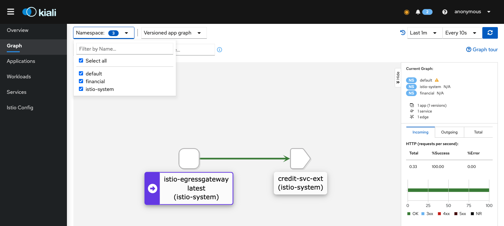

Na seção anterior exploramos a implantação canário com _VirtualService_ e _DestinationRule_ e como se relaciona com os serviços do k8s e dicutimos como permiir que o tráfego de fora pode chegue até a nossa aplicação.

Existem algumas opções para permitir que o tráfego externo chegue ao nosso cluster, são elas:

* Serviços do tipo [NodePort](https://kubernetes.io/docs/concepts/services-networking/service/#nodeport) - Expõe o serviço no IP de cada nó em uma porta estática (o NodePort). Um serviço ClusterIP para o qual o serviço NodePort roteia, é criado automaticamente. Você poderá acessar com o Serviço NodePort, de fora do cluster, pelo endereço `NodeIP:NodePort`.
* Serviços do tipo [LoadBalancer](https://kubernetes.io/docs/concepts/services-networking/service/#loadbalancer) - Expõe o serviço externamente usando o balanceador de carga de um provedor. Os serviços NodePort e ClusterIP, para os quais o balanceador de carga externo roteia, são criados automaticamente. Com Minikube e Docker-Desktop é possível criar serviços do tipo _LoadBalancer_ e o endereço localhost será atribuído como IP externo.
* k8s [Ingress](https://kubernetes.io/docs/concepts/services-networking/ingress/) - Expõe as rotas HTTP e HTTPS de fora do cluster para serviços dentro do cluster. O roteamento de tráfego é controlado por regras definidas no recurso Ingress. Esse serviço normalmente cria um serviço do tipo `LoadBalancer`. Soluções de ingress mais comuns são: [Nginx](https://kubernetes.github.io/ingress-nginx/), [Traefik](https://doc.traefik.io/traefik/providers/kubernetes-ingress/), [Kong](https://github.com/Kong/kubernetes-ingress-controller) e [Istio](https://istio.io/latest/docs/tasks/traffic-management/ingress/).

Iremos explorar o _gateway_ do Istio.

## O que são _gateways_ no Istio

Os _gateways_ do Istio são aplicações independentes (Envoys) que controlam o tráfego das requisições. Eles as recebem, avaliam, criam logs e as redirecionam para dentro ou fora da malha de serviços.

Há algumas formas de fazer isso, podemos configurar os [serviços do kubernetes](https://kubernetes.io/docs/concepts/services-networking/service/) (_LoadBalancer_ e _NodePort_), mas consumiríamos balanceadores de carga, que na nuvem são recursos pagos, ou podemos configurar um _NodePort_, porém, além de consumirem portas, não funcionariam com os _istio-proxies_ porque as requisições seriam direcionadas para o POD e só então chegariam ao _proxy_, dessa forma, o _NodePort_ iria direcionar uma fração para cada POD que fizer parte do seletor e só então as requisições seriam tratadas pelo Istio.


Como ilustrado, somente 50% das requisições externas chegariam ao POD A, sendo assim, mesmo que configurassemos o _proxy_ para lidar com o tráfego, seria tarde demais.

A solução é a adição de um _gateway_ ([ingress gateway](https://istio.io/latest/docs/tasks/traffic-management/ingress/#accessing-istio-service-mesh-by-a-browser)) que entenda as configurações do Istio e faça o trabalho de direcionar para os PODs. Para isso o Istio inclue um _gateway_ que é identico ao Envoy que utilizamos nas nossas aplicações.


O Istio configura o Envoy em um POD independente para fazer o papel de Ingress (entrada) e outro para Egress (saída). Sendo o mesmo Envoy que está em execução com nossa aplicação, ele é configurado pelo Istio com o objetivo de direcionar o tráfego para os nossos _VirtualServices_, funcionando como um _proxy_ reverso.

Vamos habilitá-los na nossa instalação.

`istioctl install --set profile=demo --skip-confirmation`{{execute T1}}

Você pode ver a diferença entre os perfís de instalação em [Istio - Installation Configuration Profiles](https://istio.io/latest/docs/setup/additional-setup/config-profiles/).

Vamos verificar o que temos instalado.

`kubectl get pods -n istio-system`{{execute T1}}

Foram adicionados dois PODs, o istio-ingressgateway  e o istio-egressgateway, ambos utilizam a mesma imagem do proxy-istio é injetado com nossa aplicação, vamos conferir.

Preste atenção também aos rótulos, principalmente o `appp` e o `istio`.

`kubectl describe deploy/istio-ingressgateway -n istio-system`{{execute T1}}

Procure pela configuração `Containers` e encontrará o istio-proxy com a imagem docker.io/istio/proxyv2:1.7.4, mas note que há apenas um container e não dois como nas nossas aplicações, isto é claro porque aqui a aplicação é o proxy.

Vamos verificar o serviço para identificar como acessar o gateway.

`kubectl get svc -l "app=istio-ingressgateway" -n istio-system`{{execute T1}}

O ingress gateway do Istio tem um serviço do tipo _LoadBalancer_ com uma série de portas configuradas e, no caso do docker-desktop, o IP externo é o `localhost`.

Uma forma segura de determinar o endereço do gateway é inspecionando o serviço do istio-ingressgateway:

```
# Configurando acesso ao Ingress
export INGRESS_HOST=$(kubectl -n istio-system get service istio-ingressgateway -o jsonpath='{.status.loadBalancer.ingress[0].ip}')
export INGRESS_PORT=$(kubectl -n istio-system get service istio-ingressgateway -o jsonpath='{.spec.ports[?(@.name=="http2")].port}')
export SECURE_INGRESS_PORT=$(kubectl -n istio-system get service istio-ingressgateway -o jsonpath='{.spec.ports[?(@.name=="https")].port}')
export TCP_INGRESS_PORT=$(kubectl -n istio-system get service istio-ingressgateway -o jsonpath='{.spec.ports[?(@.name=="tcp")].port}')

echo "Ingress uri"
echo http://$INGRESS_HOST:$INGRESS_PORT
echo https://$INGRESS_HOST:$SECURE_INGRESS_PORT
```{{execute}}

> Execute o comando nos dois terminais (clique na aba terminal 1 e clique no comando acima e repita para o terminal 2.)

Claro que ainda não configuramos nenhum VirtualService para utilizar esse gateway. Vamos configurar o front-end para utilizá-lo.

## Configurando um ingress _gateway_

Gateway padrão

`kubectl apply -f assets/exemplos/simul-shop/istio/10/default-gateway.yaml`{{execute}}

Vamos acessar a uri:

`curl -v http://$INGRESS_HOST:$INGRESS_PORT`{{execute}}

Retornou o erro _404 Not Found_ pelo _server: istio-envoy_, o que indica que alcançamos o gateway, mas não há configuração que indique para onde direcionar a requisição.

Vamos configurar o [front-end VirtualService](assets/exemplos/simul-shop/istio/10/front-end-with-gateway.yaml) para utilizar esse _gateway_.

`kubectl apply -f assets/exemplos/simul-shop/istio/10/front-end-with-gateway.yaml`{{execute}}

Vamos tentar novamente.

`curl -v http://$INGRESS_HOST:$INGRESS_PORT`{{execute}}

Sucesso, nossa requisição fez todo o caminho de fora do cluster, passando pelo serviço do kubernetes (LoadBalancer), alcançou o POD do gateway (istio-ingressgateway) e com as configurações de _Gateway_ e _VirtualService_ chegou até o POD da nossa aplicação (onde passou pelo container do istio-proxy e finalmente o container da aplicação).

Podemos gerar tráfego acessando o serviço da nossa máquina, execute o script [assets/scripts/call-local.sh](assets/scripts/call-local.sh) em um terminal.

Vamos verificar como o kiali exibe essa configuração.

> Para acessar o kiali - <https://[[HOST_SUBDOMAIN]]-20001-[[KATACODA_HOST]].environments.katacoda.com>.

Caso já não esteja em execução

`istioctl dashboard kiali &`{{execute}}

`export KIALI_PID=$!`{{execute}}


Agora conseguimos ver a origem das nossas requisições com uma pequena modificação no _VirtualService_. O Istio separa as configurações do _gateway_ (L3/L4) das configurações das rotas (L7), com isso podemos reaproveitá-las para vários _VitrualServices_.

Você pode combinar todas as configurações que fizemos até agora e adicionar o _gateway_ para receber tráfego externo. Aplique a configuração [assets/exemplos/simul-shop/istio/10/front-end-canary-release-with-gateway.yaml](assets/exemplos/simul-shop/istio/10/front-end-canary-release-with-gateway.yaml) e teste ([assets/scripts/call-local.sh](assets/scripts/call-local.sh)) para verificar o resultado da nossa implantação canário.

### Configurando um domínio para o ingress

Utilizamos um caracter curinga, mas em produção iremos configurar um domínio para o ingress e certificados TLS para torná-lo seguro.

Vamos modificar as configurações para utilizar um domínio, mas como não temos um, iremos simular.

Há duas maneiras de fazê-lo, adicionando uma entrada em seu arquivo de hosts (linux e mac `/etc/hosts`, windows `C:\Windows\System32\drivers\etc\hosts` ou passar como parâmetros para o comando `curl -H "Host: www.simul-shop.com" --resolve "www.simul-shop.com:443:127.0.0.1`.

Faremos os dois, adicionaremos no arquivo de hosts e em outros exemplos usaremos o parâmetro `resolve`.

```hosts
127.0.0.1   simul-shop.com www.simul-shop.com
```

> Coloque o IP da variável $INGRESS_HOST. Se o seu endereço é público e você tem acesso a um DNS, pode ignorar essa configuração e configurar um registro no DNS.

Salve o arquivo e verifique `ping www.simul-shop.com`, deve resolver para 127.0.0.1.

Agora vamos remover as configurações do Istio que fizemos anteriormente e aplicar as novas:

Remover a configuração do front-end

`kubectl delete -f assets/exemplos/simul-shop/istio/10/front-end-with-gateway.yaml`{{execute}}

Aplicar novamente a versão v2 do front-end

`kubectl apply -f assets/exemplos/simul-shop/manifests/8/front-end-deployment-v2.yaml`{{execute}}

Aplicar a configuração do gateway

`kubectl apply -f assets/exemplos/simul-shop/istio/10/default-gateway-with-domain.yaml`{{execute}}

Aplicar a configuração da implantação canário

`kubectl apply -f assets/exemplos/simul-shop/istio/10/front-end-canary-release-with-gateway.yaml`{{execute}}

Agora podemos testar, no terminal, sem a necessidade de usar o login container, se ainda estiver aberto, saia com o comando `exit`e execute o script [assets/scripts/call-simul-shop.sh](assets/scripts/call-simul-shop.sh).

No kiali devemos ter algo parecido com isso:


## Configurando segurança (TLS) para o ingress

Até agora todas as nossas requisições foram HTTP, está na hora de subir a régua da seguranca e configurar o nosso ingress para que as requisições sejam realizadas de forma segura, ou seja, HTTPS. Consulte também a [documentação](https://istio.io/latest/docs/tasks/traffic-management/ingress/secure-ingress/#configure-a-tls-ingress-gateway-for-a-single-host) do Istio para mais informações.

A primeira coisa que precisamos é obter um certificado para o nosso domínio, há diversas maneiras de obtê-los, iremos criar o nosso, também chamado de auto-gerado.

Nosso dominio será www.simul-shop.com.

```bash
domain=simul-shop.com
subjectAltName="DNS:${domain},DNS:www.${domain}"
dn="O=SimulShop \n CN=*.${domain}"

# root certificate
openssl req -newkey rsa:2048 -x509 -sha256 -nodes -days 365 \
     -out assets/exemplos/simul-shop/certs/${domain}.crt \
    -keyout assets/exemplos/simul-shop/certs/${domain}.key \
    -config <(printf "[req] \n prompt=no \n utf8=yes \n distinguished_name=dn_details \n req_extensions=san_details \n [dn_details] \n ${dn} \n [san_details] \n subjectAltName=${subjectAltName}")

# certificate and a private key
openssl req -newkey rsa:2048 -nodes \
    -out assets/exemplos/simul-shop/certs/all.${domain}.csr \
    -keyout assets/exemplos/simul-shop/certs/all.${domain}.key \
    -config <(printf "[req] \n prompt=no \n utf8=yes \n distinguished_name=dn_details \n req_extensions=san_details \n [dn_details] \n ${dn} \n [san_details] \n subjectAltName=${subjectAltName}")

openssl x509 -req -days 365 \
    -CA assets/exemplos/simul-shop/certs/${domain}.crt \
    -CAkey assets/exemplos/simul-shop/certs/${domain}.key \
    -set_serial 0 \
    -in assets/exemplos/simul-shop/certs/all.${domain}.csr \
    -out assets/exemplos/simul-shop/certs/all.${domain}.crt
```{{execute}}

Criaremos um _Secret_ para armazenar o certificado:

`kubectl delete secret ${domain}-credential -n istio-system`

```
kubectl create -n istio-system secret tls \
    ${domain}credential \
    --key=assets/exemplos/simul-shop/certs/all.${domain}.key \
    --cert=assets/exemplos/simul-shop/certs/all.${domain}.crt
```{{execute}}

[Opcional] Salve o secret um arquvio yaml. Remova os campos gerados pelo kubernetes:

`kubectl get secret/www-simul-shop-credential -n istio-system -o yaml > assets/exemplos/simul-shop/templates/secret.yaml`{{execute}}

[Opcional] A pode aplicá-lo quando necessário:

`kubectl apply -f assets/exemplos/simul-shop/templates/secret.yaml`{{execute}}

Vamos [configurar](assets/exemplos/simul-shop/istio/10/default-gateway-with-domain-tls.yaml) o certificado no nosso gateway

`kubectl apply -f assets/exemplos/simul-shop/istio/10/default-gateway-with-domain-tls.yaml`{{execute}}

Vamos aguardar alguns minutos e realizar um teste. Execute o script [assets/scripts/call-simul-shop-tls.sh](assets/scripts/call-simul-shop-tls.sh) em um terminal.

Se tudo estiver OK, o resultado será:

```bash
* Resolve address 'localhost' found illegal!
* Couldn't parse CURLOPT_RESOLVE entry 'www.simul-shop.com:443:localhost'!
*   Trying 127.0.0.1:443...
* Connected to www.simul-shop.com (127.0.0.1) port 443 (#0)
* ALPN, offering http/1.1
* successfully set certificate verify locations:
*   CAfile: assets/exemplos/simul-shop/certs/all.simul-shop.com.crt
  CApath: none
* TLSv1.3 (OUT), TLS handshake, Client hello (1):
* TLSv1.3 (IN), TLS handshake, Server hello (2):
* TLSv1.3 (IN), TLS handshake, Encrypted Extensions (8):
* TLSv1.3 (IN), TLS handshake, Certificate (11):
* TLSv1.3 (IN), TLS handshake, CERT verify (15):
* TLSv1.3 (IN), TLS handshake, Finished (20):
* TLSv1.3 (OUT), TLS change cipher, Change cipher spec (1):
* TLSv1.3 (OUT), TLS handshake, Finished (20):
* SSL connection using TLSv1.3 / TLS_AES_256_GCM_SHA384
* ALPN, server accepted to use http/1.1
* Server certificate:
*  subject: O=SimulShop; CN=*.simul-shop.com
*  start date: Dec  5 20:54:42 2020 GMT
*  expire date: Dec  5 20:54:42 2021 GMT
*  common name: *.simul-shop.com (matched)
*  issuer: O=SimulShop; CN=*.simul-shop.com
*  SSL certificate verify ok.
> GET /s HTTP/1.1
> Host: www.simul-shop.com
> User-Agent: curl/7.71.1
> Accept: */*
> 
* TLSv1.3 (IN), TLS handshake, Newsession Ticket (4):
* TLSv1.3 (IN), TLS handshake, Newsession Ticket (4):
* old SSL session ID is stale, removing
* Mark bundle as not supporting multiuse
< HTTP/1.1 200 OK
< date: Sat, 05 Dec 2020 21:00:40 GMT
< server: istio-envoy
< content-length: 172
< content-type: application/json
< x-envoy-upstream-service-time: 51
< 
* Connection #0 to host www.simul-shop.com left intact
{"name":"split","description":"List ['http://login:8000/', 'http://catalogue:8000/', 'http://orders:8000/s']","app":"front-end","version":"v1","when":"2020-12-05 21:00:40"}
```

Você poderá acessar o front-end pelo navegador, mas como o certificado não foi assinado por uma autoridade conhecida pelo navegador, ele irá bloqueá-la.


### Dica pro

É comum configurar apenas um gateway padrão (default-gateway) para todo o cluster, mas essa prática trás alguns problemas, veremos isso quando configurarmos rotas por caminho.

Se você divide o cluster com outros desenvolvedores é bem provável que eles irão criar configurações para o Istio sem avisá-lo, o que pode causar conflitos. Configurações conflitantes serão avaliadas na ordem em que forem aplicadas, ou seja, a última irá prevalecer.

Uma dica é ter mais de um ingress, em clusters compartilhados você pode criar um por _namespace_, por exemplo, ou criar ingress dedicados para uma finalidade ou FQDN.

## Acessando serviços fora da malha

O Istio mantém um registro de todos os serviços utilizando as APIs do kubernetes para fazer a auto-descoberta dos serviços. O Istio oferecer suporte à descoberta para vários ambientes, como Kubernetes, Consul ou VMs.

Porém, serviços que estão fora da malha não serão descobertos e é onde entra o _ServiceEntry_.

O _ServiceEntry_ permite adicionar entradas adicionais ao registro de serviço interno do Istio, para que os serviços de auto-descoberta na malha possam acessa-los e rotea-los.

Como o nosso serviço genérico funciona invocando qualquer url, interna ou externa, vamos modificar o `order` para invocar um serviço externo.

Para criar um serviço externo, iremos configurar um _generic service_ em um _namespace_ que não tem o rótulo de injeção do _sidecar_ do Istio, ou seja, criaremos um POD sem o istio-proxy.

Cria o serviço credit no namespace financial:

`kubectl apply -f assets/exemplos/simul-shop/manifests/10/credit-deployment.yaml`{{execute}}

Modificando o order para invocar serviço externo:

`kubectl apply -f assets/exemplos/simul-shop/manifests/10/orders-deployment-external-api.yaml`{{execute}}

httpbin service:

`kubectl apply -f istio-1.9.1/samples/httpbin/httpbin.yaml`{{execute}}

Vamos para o [kiali](http://localhost:20001) verificar como ficou essa configuração, mas antes precisaremos de tráfego, execute o [assets/scripts/call-simul-shop.sh](assets/scripts/call-simul-shop.sh) em um terminal.


Sem as configurações do Istio, o kiali exibe o tráfego de saída como um "buraco negro", um _PassthroughCluster_ porque ele não infere sobre o destino. Isso será válido para quantos serviços externos forem chamado, fazendo com que várias linhas convertam para o mesmo ponto.

Agora vamos adicionar algumas [configurações](assets/exemplos/simul-shop/istio/credit-serviceentry.yaml) de saída.

`kubectl apply -f assets/exemplos/simul-shop/istio/credit-serviceentry.yaml`{{execute}}

Com a configuração do _ServiceEntry_ adicionamos ao registro de serviços do Istio o nosso serviço de crédito, isso possibilia que o Kiali exiba como um destino conhecido.


## Configurando um gateway de saída (egress)

Os gateways são usados principalmente para gerenciar o tráfego de entrada, mas você também pode configurar _gateways_ de saída. Um gateway de saída permite configurar nós de saída dedicados para o tráfego que sai da malha, permitindo limitar quais serviços podem ou devem acessar redes externas ou habilitar o controle seguro do tráfego de saída para adicionar segurança à malha.

Considere uma organização que tem um requisito de segurança restrito de que todo o tráfego que sai da malha de serviço deve fluir por meio de um conjunto de nós dedicados. Esses nós serão executados em máquinas dedicadas, separados do resto dos nós que executam aplicativos no cluster. Esses nós especiais servirão para aplicação de política no tráfego de saída e serão monitorados de forma mais completa do que outros nós.

Outro caso de uso é um cluster onde os nós do aplicativo não têm IPs públicos, de modo que os serviços em malha executados neles não podem acessar a Internet.

A figura abaixo ilustra como configuraremos o nosso gateway:


Nesta [configuração](assets/exemplos/simul-shop/istio/10/egress-example-credit.yaml) temos:

* Definir o serviço externo através de um _ServiceEntry_;
* Configurar um _gateway_ de saída
* Configurar um _VirtualService_ para redirecionar o tráfego do _sidecar_ para o egress

Mas antes de aplicá-lo, vamos remover o que fizemos até agora, deixando apenas o serviço `credit`.

Alguns podem retornar que não encontraram o recurso:

`kubectl delete -f assets/exemplos/simul-shop/manifests/4`{{execute}}

`kubectl delete -f assets/exemplos/simul-shop/manifests/8/front-end-deployment-v2.yaml`{{execute}}

`kubectl delete -f assets/exemplos/simul-shop/manifests/9/front-end-deployment-v3.yaml`{{execute}}

`kubectl delete -f assets/exemplos/simul-shop/istio/10/front-end-canary-release-with-gateway.yaml`{{execute}}

`kubectl delete -f assets/exemplos/simul-shop/istio/10/default-gateway-with-domain.yaml`{{execute}}

`kubectl delete -f assets/exemplos/simul-shop/istio/10/credit-serviceentry.yaml`{{execute}}

`kubectl delete -f assets/exemplos/simul-shop/manifests/10/orders-deployment-external-api.yaml`{{execute}}

Conferindo se tudo foi excluído

Namespace default - somente o serviço do kuberentes:

`kubectl get deploy,svc,gateway,vs,dr`{{execute}}

Namespace financial - nenhum recurso:

`kubectl get deploy,svc,gateway,vs,dr -n financial`{{execute}}

Namespace istio-system - nenhum recurso:

`kubectl get gateway,vs,dr -n istio-system`{{execute}}

Agora vamos aplicar uma nova configuração:

* Cliente para chamar o serviço credit
* Serviço credit fora da malha
* Configuração do Gateway, ServiceEntry e VirtualService.
* Execução da carga
* Validação e análise no kiali

Cliente:

`kubectl apply -f istio-1.9.1/samples/sleep/sleep.yaml`{{execute}}

Serviço credit:

`kubectl apply -f assets/exemplos/simul-shop/manifests/10/credit-deployment.yaml`{{execute}}

Configuração Gateway, ServiceEntry e VirtualService:

`kubectl apply -f assets/exemplos/simul-shop/istio/10/egress-example-credit.yaml`{{execute}}

E executar chamadas para o serviço em um terminal ([assets/scripts/call-credit.sh](assets/scripts/call-credit.sh))

```
export SOURCE_POD=$(kubectl get pod -l app=sleep -o jsonpath={.items..metadata.name})

while true                                                            
do
kubectl exec "$SOURCE_POD" -c sleep -- curl -sL -D - http://credit.financial/
echo
sleep 1
done
```{{execute T2}}

Vamos verificar como ficou no kiali. Selecione os três _namespaces_ (default, financial, istio-system)

O gráfico de _app_:



E a configuração:

![kiali com a configuração do egress para credit]./media/kiali-config-egress-credit.png)

### Considerações

Não iremos manter a configuração de egress para a nossa aplicação, como discutido no início da seção, se você não tem um requisito para restringir todo tráfego de saída, não há necessidade dessa configuração, ao contrário do _ServiceEntry_ que manteremos porque auxilia no entendimento da malha e, como veremos nas próximas seções, poderemos aplicar políticas.

Então, vamos apagar os recursos e reinstalar a nossa aplicação, mais uma vez, mantermos o serivço de crédito e a aplicação sleep para chamar serviços utilizando o curl de dentro do cluster, mas removeremos a configuração do _gateway_ externo.

Pode para a execução das chamadas od serviço no terminal.

Gateway padrão:

`kubectl delete -f assets/exemplos/simul-shop/istio/10/default-gateway.yaml`{{execute}}

Configuração front-end:

`kubectl delete -f assets/exemplos/simul-shop/istio/10/front-end-with-gateway.yaml`{{execute}}

Configuração Gateway, ServiceEntry e VirtualService:

`kubectl delete -f assets/exemplos/simul-shop/istio/10/egress-example-credit.yaml`{{execute}}

Cria o serviço credit no namespace financial:

`kubectl delete -f assets/exemplos/simul-shop/manifests/10/credit-deployment.yaml`{{execute}}

Modificando o order para invocar serviço externo:

`kubectl delete -f assets/exemplos/simul-shop/manifests/10/orders-deployment-external-api.yaml`{{execute}}

Restaura a configuração dos deplpyments:

`kubectl apply -f assets/exemplos/simul-shop/manifests/4`{{execute}}

httpbin service:

`kubectl delete -f istio-curso/istio-1.9.1/samples/httpbin/httpbin.yaml`{{execute}}

## Conclusão

_Gateways_ são _proxies_ implementados pelo Istio utilizando o Envoy que tem como função controlar a entrada e saída do tráfego de requisições da nossa malha, mas em resumo são Envoys que são configurados para lidar com as camadas de transporte a apresentaçõa ([modelo OSI](https://en.wikipedia.org/wiki/OSI_model)) e em conjunto com os _VirtualServices_, completam as configurações de gerenciamento de tráfego.

Foi uma longa jornada até aqui, mas agora temos as ferramentas para configurar o Istio para atender diversos cenários e de forma segura, na próxima seção continuaremos explorarando o gerencimaento de tráfego e como resolver problemas complexos combinando as ferramentas que já temos.
