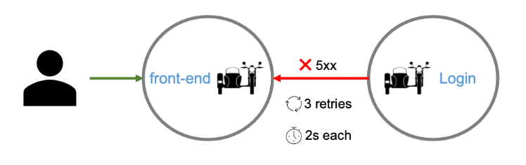
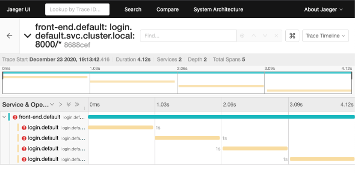
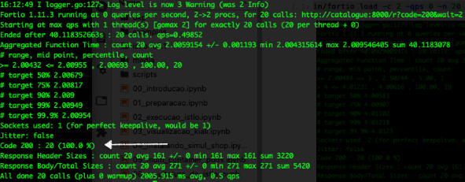

Nesta seção iremos abordar mais formas de gerenciar o tráfego com o Istio, até o momento vimos basicamente uma formas, o roteamento por nome do host (FQDN).

Nosso novo cenário a nossa aplicação irá expor os serviços de _login_ e _order_ e algumas das suas APIs para outras aplicações.

Não precisamos expor cada um dos serviços da nossa aplicação, podemos criar um ou mais _VirtualServices_ que representem esse cenário:

| url interna               | url externa                                  | service     | port |
| ---                       | ---                                          | ---         | ---  |
| http://front-end          | http://INGRESS_HOST:INGRESS_PORT/            | front-end   | 8000 |
|                           | http://INGRESS_HOST:INGRESS_PORT/front-end   |             |      |
| http://login              | http://INGRESS_HOST:INGRESS_PORT/login       | login       | 8000 |
| http://catalogue          | http://INGRESS_HOST:INGRESS_PORT/catalogue   | catalogue   | 8000 |
| http://orders             |                                              | orders      | 8000 |
| http://shipping           |                                              | shipping    | 8000 |
| http://cart               |                                              | cart        | 8000 |
| http://payment            |                                              | payment     | 8000 |
| http://accounts           |                                              | accounts    | 8000 |

Mantenha um terminal aberto e o Kiali, iremos utilizá-los com frequência.

Vamos determinar a URI do Ingress Gateway e configurá-lo:

```
# Configurando acesso ao Ingress
export INGRESS_HOST=$(kubectl -n istio-system get service istio-ingressgateway -o jsonpath='{.status.loadBalancer.ingress[0].ip}')
export INGRESS_PORT=$(kubectl -n istio-system get service istio-ingressgateway -o jsonpath='{.spec.ports[?(@.name=="http2")].port}')
export SECURE_INGRESS_PORT=$(kubectl -n istio-system get service istio-ingressgateway -o jsonpath='{.spec.ports[?(@.name=="https")].port}')
export TCP_INGRESS_PORT=$(kubectl -n istio-system get service istio-ingressgateway -o jsonpath='{.spec.ports[?(@.name=="tcp")].port}')

echo "Ingress uri"
echo http://$INGRESS_HOST:$INGRESS_PORT
echo https://$INGRESS_HOST:$SECURE_INGRESS_PORT
```{{execute}}

Configurar um ingress gateway:

`kubectl apply -f assets/exemplos/simul-shop/istio/10/default-gateway.yaml`{{execute}}

### Discussão: Versionamento de recursos web

Embora esteja fora do escopo desse curso, essa é uma discussão que em algum momento do desenvolvimento do sistema você terá que enfrentar, como indicar para os consumidores a versão da sua aplicação.

Podemos separar o tema em duas partes:

* Interface com usuário final
* APIs

#### Interface web

Não é interessante apresentar qualquer forma de versionamento para o usuário final, ou seja, não deveríamos expor qustões internas do sistemas, como portas, protocolos e versões para os usuários finais.

Também dificultaria testes A/B, implantações canário, ou qualquer forma de manipulação das requisições que necessitasse de transparência para o consumidor.

#### APIs

É uma estória completamente diferente, os consumidores destes recursos procuram algum tipo de garantia de que as versões que utilizam são estáveis, que o contrato que estabeleceram com o produtor não seja alterado para aquele ponto no tempo.

Existem prós e contras para cada escolha no forma de versionamento, entre elas:

* **Controle de versão por meio de caminho na URI**: http://www.simul-shop.com/orders/api/v1
    * Prós: os clientes podem armazenar recursos em cache facilmente
    * Contras: esta solução tem ramificações na base de código
* **Controle de versão por meio de parâmetros de consulta**: http://www.simul-shop.com/orders/api?version=v1
    * Prós: é uma maneira direta de criar uma versão de API e é fácil padronizar para a versão mais recente
    * Contras: os parâmetros de consulta são mais difíceis de usar para rotear solicitações para a versão adequada da API
* **Controle de versão por meio de cabeçalhos personalizados**: `curl -H “Accept-versions: v1” http://www.simul-shop.com/orders/api`
    * Prós: não confunde o URI com informações de versão
    * Contras: requer cabeçalhos personalizados
* **Controle de versão por meio de negociação de conteúdo**: `curl -H “Accept: application/vnd.xm.device+json; version=v1” http://www.simul-shop.com/orders/api`
    * Prós: nos permite criar versões de uma representação de recurso único em vez de criar versões de toda a API, o que nos dá um controle mais granular sobre as versões. Não requer a implementação de regras de roteamento de URI.
    * Contras: Exigir cabeçalhos HTTP com tipos de mídia torna mais difícil testar e explorar a API usando um navegador.

Do ponto de vista do design da APIs, incorporar a versão no URL não é uma prática recomendada porque resulta mudanças nas URLs, mesmo que o próprio recurso não tenha mudado.

[Roy Fielding](https://en.wikipedia.org/wiki/Roy_Fielding), um dos principais contribuidores para o protocolo HTTP e criador to REST, não recomenta utilizar qualquer forma de controle de versão para APIs ([Apresentação](https://www.slideshare.net/evolve_conference/201308-fielding-evolve)).

#### Por que não versionamento semântico?

De fato, a maioria das APIs utiliza o [versionamento semântico](https://semver.org/), mas não a versão completamente, pelo menos não na URI. Nada impediria que suas URL fossem `https://www.simul-shop.com/cart/api/1.0.2', porém o número da versão principal é o que você precisa para indicar aos seus consumidores a compatibilidade entre as versões. Os números que representam as versões menores e as correções não deveriam quebrar a compatibilidade e não justificariam a mudança da URL.

Se você precisa expressar a versão completa para seus consumidores, pode utilizar os cabeçalhos personalizados, como por exemplo o `Accept-versions` ou `Content-versions`.

#### Considerações

Em resumo, quando tratamos de interface web, geralmente procuramos ser o mais transparente o possível para o usuário final, mas se a questão é APIs, nossos consumidores, geralmente outros técnicos, necessitam de alguma garantia que as mesmas versões geram os mesmos resultados. Isso pode dificultar o uso de implementação canário por uma questão de semântica.

Felizmente, o Istio fornece recursos para lidar com todas as opções, então nós optamos por indicar a versão no cabeçalho, quando necessário.

Também optamos por não adicionar a palavra `api` na URL, por uma simples questão, ela não contribui para os nossos exemplos e você pode optar em criar seus serviços com interfaces web (micro front-ends) e programáticas (APIs), sendo assim, você poderia adicionar a palavra depois do roteamento do Istio, mas isso é com você.

## Rota baseada no caminho


Vamos implementar a tabela acima, já vimos como configurar _VirtualService_ para hosts, vamos configurá-lo para caminho, a estrutura para as URIs do front-end

```yaml
spec:
  hosts:
    - "*"
  gateways:
  - default-gateway
  http:
  - match: # <-- Regra prefixo /catalogue
    - uri:
        prefix: /login
    rewrite:
      uri: /
    route:
    - destination:
        host: login # FQDN completo ou abreviado
        subset: v1
  - match: # <-- Regra prefixo /catalogue
    - uri:
        prefix: /catalogue
    rewrite:
      uri: /
    route:
    - destination:
        host: catalogue # FQDN completo ou abreviado
        subset: v1
  - route: # <-- Rota padrão
    - destination:
        host: front-end 
        subset: v1
```

**Dica pro**: Você pode configurar regras para vários serviços no mesmo VirtualService, porém, para a organização, governança e entrega dessas regras pode se tornar um desafio conforme o número de serviços cresce.

Uma boa prática é criar um arquivo de entrega para cada serviço, você pode manter as _DestinationRules_ no mesmo arquivo ou em arquivos separados. Nestes exemplos, manteremos as _DestinationRules_ e _VirtualServices_ no mesmo arquivo.

Vamos aplicar as configuração para os serviços de [login](assets/exemplos/simul-shop/istio/11/login-dr-vs.yaml), [catalogue](assets/exemplos/simul-shop/istio/11/catalogue-dr-vs.yaml) e [front-end](assets/exemplos/simul-shop/istio/11/front-end-dr-vs.yaml).

Login - DestinationRules e VirtualServices:

`kubectl apply -f assets/exemplos/simul-shop/istio/11/login-dr-vs.yaml`{{execute}}

Catalogue - DestinationRules e VirtualServices:

`kubectl apply -f assets/exemplos/simul-shop/istio/11/catalogue-dr-vs.yaml`{{execute}}

Front-end - DestinationRules e VirtualServices

`kubectl apply -f assets/exemplos/simul-shop/istio/11/front-end-dr-vs.yaml`{{execute}}

Vamos verificar o que foi criado:

`kubectl get vs,dr`{{execute}}

Vamos testando as configurações.

front-end - rota padrão:

`http -v "$INGRESS_HOST:$INGRESS_PORT/"`{{execute}}

front-end - regra match.uri:

`http -v "$INGRESS_HOST:$INGRESS_PORT/front-end"`{{execute}}

Login - regra match.uri:

`http -v "$INGRESS_HOST:$INGRESS_PORT/login"`{{execute}}

Catalogue - regra match.uri:

`http -v "$INGRESS_HOST:$INGRESS_PORT/catalogue"`{{execute}}

## Rota baseada no cabeçalho

Os _VirtualServices_ são uma das principais configurações do gerenciamento de tráfico do Istio, nesse exemplo iremos utilizar os dados do cabeçalho da requisição para decidir qual versão do serviço será servida para o requisitante.

Esse tipo de controle permite realizar testes e entregas para grupos de usuários. Diferente da entrega canário, que direciona o tráfego com base em percentuais, a rota baseada no cabeçalho, permite mirar grupos específicos.

Neste cenário os usuários que acessarem o front-end na região _Southeast_ serão direcionados para a versão 2 e os demais para a versão 1. 

Vamos aplica a configuração [front-end-route-header.yaml](assets/exemplos/simul-shop/istio/11/front-end-route-header-vs.yaml).

_Deployment_ da versão 2 do front-end:

`kubectl apply -f assets/exemplos/simul-shop/manifests/8/front-end-deployment-v2.yaml`{{execute}}

Configurar o VirtualService do front-end para direcionar com base nos campos do cabeçalho:

`kubectl apply -f assets/exemplos/simul-shop/istio/11/front-end-route-header-vs.yaml`{{execute}}

Nossa aplicação já pode ser acessada pela uri <http://INGRESS_HOST:INGRESS_PORT/>

Rota padrão:

`http -v "$INGRESS_HOST:$INGRESS_PORT"`{{execute}}

A versão acessada foi a v1, vamos adicionar o cabeçalho.

Regra #1 - campo user-region do cabeçalho igual a Southeast:

`http -v "$INGRESS_HOST:$INGRESS_PORT" "user-region: Southeast"`{{execute}}

Com o campo no cabeçalho o serviço chamado foi o v2.

Você pode usar uma combinação de campos do cabeçalho e tirar proveito de campos [padrão](https://en.wikipedia.org/wiki/List_of_HTTP_header_fields) para guiar a lógica do seu serviço.

* content-length
* content-type
* date
* Host
* User-Agent

## Multiplas regras de tráfego

Como discutimos anteriormente, você pode combinar multiplas regras em um único _VirtualService_, inclusive de serviços diferentes, porém isso pode ficar confuso conforme o numero de serviços cresce, mas é uma boa prática, combinar as regras em um único _VirtualService_ para o mesmo serviço, dessa forma podemos avaliar o seu comportamento em um único lugar.

As regras são avaliadas na ordem, as rotas HTTP serão aplicadas às portas de serviço da plataforma chamadas 'http -' / 'http2 -' / 'grpc- *', portas de gateway com protocolo HTTP / HTTP2 / GRPC / TLS-terminated-HTTPS e portas de entrada de serviço usando HTTP / HTTP2 / Protocolos GRPC. A primeira regra que corresponder a solicitação de entrada será usada.

Neste cenário queremos combinar a uri com campos do cabeçalho, somente requisições com uri iniciando com `/front-end` e cabeçalho com o campo `user-region: Southeast` serão direcionados para a v2.

Nesse cenário hipotético, após os testes, iremos direcionar as requisições com prefixo `/front-end` também para a v2.

E como boa prática, se nenhuma das regras for satisfeita, a requisição será direcionada para a v1.

Virtual Service:

`kubectl apply -f assets/exemplos/simul-shop/istio/11/front-end-multi-route-vs.yaml`{{execute}}

Rota padrão - v1:

`http -v "$INGRESS_HOST:$INGRESS_PORT/" "user-region: Southeast"`{{execute}}

Rota padrão - v1:

`http -v "$INGRESS_HOST:$INGRESS_PORT/"`{{execute}}

Regra #2: uri iniciando em /front-end - v1 (mas pode ser alterada para outra versão):

`http -v "$INGRESS_HOST:$INGRESS_PORT/front-end"`{{execute}}

Regra #1: user-regio=Southeast e uri iniciando em /front-end - v2:

`http -v "$INGRESS_HOST:$INGRESS_PORT/front-end" "user-region: Southeast"`{{execute}}

Rota padrão, mas não tem re-escrita da URI - 404:

`http -v "$INGRESS_HOST:$INGRESS_PORT/anything"`{{execute}}

## Modificando os cabeçalhos de resposta

Os _VirtualServices_ podem adicionar ou remover campos do cabeçalho.


Neste exemplo, queremos que as requisições que não são originadas de _Southeast_ tenham o campo do cabeçalho `user-region` com o valor `other`. Esse dado pode ser utilizada para regras em outros serviços, ou para fins de log.

VirtualService:

`kubectl apply -f assets/exemplos/simul-shop/istio/11/front-end-change-header-vs.yaml`{{execute}}

Regra 1 - v2:

`http -v "$INGRESS_HOST:$INGRESS_PORT/" "user-region: Southeast"`{{execute}}

Rota padrão - v1:

`http -v "$INGRESS_HOST:$INGRESS_PORT/"`{{execute}}

Procure pelo campo `user-region` no cabeçalho. Todas as requisições que forem direcionadas pela rota padrão terão o campo `user-region: other` adicionado.

## Retentativas e timeouts

Arquiteturas distribuídas significa solicitações na rede, aumentando a chance de falhas temporárias como congestionamento da rede.

Adicionar políticas de repetição para solicitações e expiração do tempo de espera ajudam a construir serviços resilientes em uma arquitetura de serviços. Frequentemente, essa lógica de repetição é incorporada no serviço, mas com o Istio, você pode definir políticas de repetição com uma regra de tráfego, a serem executadas pelos sidecars, permitindo padronizar as políticas de forma independente dos  protocolos e linguagens de programação.

Uma configuração tentativas especifica o número máximo de vezes que um proxy Envoy tenta se conectar a um serviço se a chamada inicial falhar.

### _Timeout_

Nosso primeira [configuração](istio-curso/simul-shop/istio/11/login-timeout-vs.yaml) será ajustar o tempo de espera (timeout) para 10s. Para isso vamos configurar o _VirtualService_ do login e executar o serviço passando diferntes tempos de atraso.

> Na seção Engenharia do Caos, veremos como fazer isso usando configurações do Istio.

VirtualService:

`kubectl apply -f assets/exemplos/simul-shop/istio/11/login-timeout-vs.yaml`{{execute}}

Para testar vamos executar o serviço, mas antes, abra um terminal para monitorar os logs do serviço.

Em um terminal digite `stern -l app=login -c istio-proxy`{{execute}}

Agora vamos executar o serviço.

Atraso de 5s a 15s, incremento de 2s:

```
for i in $(seq 5 2 15);
    do kubectl exec -it svc/front-end -c front-end -- http -v "http://login:8000/r?code=200&wait=$i";
done
```

O tempo de espera (timeout) ajustado para 10 segundos permitiu que o serviço fosse executado para tempos de espera 5s, 7s e 9s. Além desse ponto, o serviço retornou _timeout_

### _Retries_

Neste cenário, simulamos um problema com o serviço de login. Modificaremos o _Deployment_ do `front-end` para pausar a chamada automática aos serviços, isso dificultaria acompanhar os logs.



Modificar o _VirtualService_ do front-end:

`kubectl apply -f assets/exemplos/simul-shop/manifests/8/front-end-deployment-no-auto.yaml`{{execute}}

VirtualService:

`kubectl apply -f assets/exemplos/simul-shop/istio/11/login-retry-vs.yaml`{{execute}}

Como os tempos limite, o comportamento de retentativa pode não atender às necessidades do seu aplicativo em termos de latência (muitas tentativas para um serviço com falha podem tornar as coisas piores). Você pode ajustar as configurações por serviço.

Para configurar o comportamento das retentativa, pode-se adicionar tempos limite por nova tentativa, especificando a quantidade de tempo que você deseja esperar para cada tentativa.

Nesta [configuração](assets/exemplos/simul-shop/istio/11/login-retry-vs.yaml) serão 3 tentativas após uma falha inicial, cada uma com um tempo limite de 2 segundos.

Acompanhe o log, você verá quatro entradas, a inicial e mais três, uma vez que nosso serviço continuará a retornar o erro em todas as tentativas.

`kubectl exec -it svc/front-end -c front-end -- bash -c 'time http -v "http://login:8000/r?code=504&wait=1"'`{{execute}}

O tempo total de execução foi 4x o tempo do serviço.

E se o serviço retornar um código 200 em qualquer uma das três tentativas, a requisição encerrará com sucesso e o tempo total de execução será a soma das tentativas.

`kubectl exec -it svc/front-end -c front-end -- bash -c 'time http -v "http://login:8000/r?code=200&wait=1"'`{{execute}}

Nesta última execução, o serviço retorna após 1s com sucesso (200).

Você deverá ver os errors no kiali e jaeger. No jaeger filtre os rastros colocando em _Service_ escolha `front-end.default` e em _Tags_ preencha com o valor `http.status_code=500`


E as execuções que acompanhamos nos logs.



Vamos restaurar as configurações do front-end e login:

Restaurando a configuração do front-end:

`kubectl apply -f assets/exemplos/simul-shop/manifests/8/front-end-deployment-no-auto.yaml`{{execute}}

`kubectl apply -f assets/exemplos/simul-shop/istio/11/front-end-dr-vs.yaml`{{execute}}

login:

`kubectl apply -f assets/exemplos/simul-shop/istio/11/login-dr-vs.yaml`{{execute}}

## Disjuntores

Os [disjuntores](https://istio.io/latest/docs/concepts/traffic-management/#circuit-breakers), analogia aos [dispositivos](https://en.wikipedia.org/wiki/Circuit_breaker) que cortam a energia elétrica em caso de sobre carga, são mecanismos úteis para incrementar a resiliência dos serviços.


Em um disjuntor, você define os limites para chamadas para hosts individuais em um serviço, como o número de conexões simultâneas ou quantas vezes as chamadas para este host falharam. Uma vez que esse limite tenha sido atingido, o disjuntor “desarma” e interrompe outras conexões com aquele host.

Usar o padrão de disjuntor ([fowler](https://martinfowler.com/bliki/CircuitBreaker.html), [richardson](https://microservices.io/patterns/reliability/circuit-breaker.html)) permite uma falha rápida em vez de os clientes tentarem se conectar a um host sobrecarregado ou com falha.

Vamos aplicar a [configuração](https://istio.io/latest/docs/reference/config/networking/destination-rule/#ConnectionPoolSettings) ([Envoy - Circuit breaking](https://www.envoyproxy.io/docs/envoy/latest/intro/arch_overview/upstream/circuit_breaking)):


```
# Config
kubectl apply -f - <<EOF
apiVersion: networking.istio.io/v1alpha3
kind: DestinationRule
metadata:
  name: catalogue-cb
spec:
  host: catalogue
  trafficPolicy:
    connectionPool:
      tcp:
        maxConnections: 1
      http:
        http1MaxPendingRequests: 1
        maxRequestsPerConnection: 1
    outlierDetection:
      consecutiveErrors: 1
      interval: 1s
      baseEjectionTime: 3m
      maxEjectionPercent: 100
EOF
```{{execute}}

A sensibilidade do disjuntor foi ajustada para:

* maxConnections: Número máximo de conexões para o host destino
* http1MaxPendingRequests: Número máximo de requisiçõe http 1.x pendentes
* maxRequestsPerConnection: Número máximo de requisições por conexão

Para serviços HTTP, os hosts que retornam continuamente erros 5xx (_outliers_) são ejetados do _pool_ por um período de tempo predefinido. Para serviços TCP, tempos limite de conexão ou falhas de conexão para um determinado host contam como um erro ao medir a métrica de erros consecutivos. Consulte a [detecção de outlier do Envoy](https://www.envoyproxy.io/docs/envoy/latest/intro/arch_overview/upstream/outlier) para obter mais detalhes.

Nessa configuração a ejeção do host do _pool_ se o número máximo de erros consecutivos for um no intervalo de um segundo. O host ejetado ficará fora por três segundos, quando uma nova requisição será enviada para ele, se for com sucesso, o hosto retorna ao _pool_.

> maxEjectionPercent é o número máximo de hosts do _pool_ que podem ser ejetados.

Para uma lista completa de atributos para http e tcp acesse [Istio - ConnectionPoolSettings](https://istio.io/latest/docs/reference/config/networking/destination-rule/#ConnectionPoolSettings).

Para simular a carga utilizaremos o [Fortio](https://github.com/fortio/fortio). Ele é uma ferramenta de teste de carga, originalmente desenvolvido para o Istio.

Cliente:

`kubectl apply -f istio-1.9.0/samples/httpbin/sample-client/fortio-deploy.yaml`{{execute}}

Teste:

`export FORTIO_POD=$(kubectl get pods -lapp=fortio -o 'jsonpath={.items[0].metadata.name}')`{{execute}}

`kubectl exec "$FORTIO_POD" -c fortio -- /usr/bin/fortio curl -quiet http://catalogue:8000/`{{execute}}

Antes de disparar a carga, abra dois terminais e monitore o _istio-proxy_.

Teminal 1 - client

`stern -l app=fortio -c istio-proxy`{{execute T1}}

Terminal 2 - server

`stern -l app=catalogue,version=v1 -c istio-proxy`{{execute T2}}

Vamos executar a carga para o serviço em um terceiro terminal:

`kubectl exec "$FORTIO_POD" -c fortio -- /usr/bin/fortio load -c 1 -qps 0 -n 20 -loglevel Warning "http://catalogue:8000/r?code=200&wait=2"`{{execute T3}}



Conte o número de logs com status 200 nos dois logs, devem coincidir com o resultado do fortio.

Vamos repetir o teste, mas dessa vez adicionando mais pressão.

> **Dica pro**: Limpe o terminal ou adicione algum espaço (<kbd>Enter</kbd>) para ficar mais fácil identificar o início de cada log da execução.

`Pare a execução no terminal 3`{{Execute interrupt T3}} e execute o comando com os novos parâmetros:`

`kubectl exec "$FORTIO_POD" -c fortio -- /usr/bin/fortio load -c 3 -qps 0 -n 20 -loglevel Warning "http://catalogue:8000/r?code=200&wait=2"`{{execute T3}}


Repita a contagem, conte também os 503.

O uso desse padrão deve ser cuidadosamente configurado e testado, acionamentoa prematuroa ou tardioa podem causar comportamentos difícies de compreender.

Use o kiali para entender a sua malha, procure os serviços que tem configurações e avalie as métricas.


Parando `terminal 1`{{Execute interrupt T1}}, `terminal 2`{{Execute interrupt T2}} e `terminal 3`{{Execute interrupt T3}}.

Removendo a configuração:

`kubectl delete dr/catalogue-cb`{{execute}}

## Espelhando o tráfego

Testar serviços em produção é complexo, porém importante para ajudar na garantia da confiabilidade.

O envio de tráfego de produção simultaneamente para uma nova versão de um serviço pode ajudar a revelar bugs que não foram encontrados durante os testes.

Usando o Istio, você pode usar o espelhamento de tráfego para duplicar o tráfego para outro serviço. Você pode incorporar uma regra de espelhamento de tráfego como parte de um pipeline de implantação canário, permitindo que você analise o comportamento de um serviço antes de enviar tráfego de missão críitica para ele.

Esse recurso permite obter dados valiosos de produção sem colocar em risco suas operações.


Vamos configurar nossa aplicação:

Deployment da ordem v2:

`kubectl apply -f assets/exemplos/simul-shop/manifests/11/orders-deployment-v2.yaml`{{execute}}

Aplicando as regras de espelhamento:

Ordem - DestinationRules e VirtualService:

`kubectl apply -f assets/exemplos/simul-shop/istio/11/orders-mirror-dr-vs.yaml`{{execute}}

Para monitorar o resultado, abra dois terminais, um monitorando a versão v1 da ordem e outro a versão v2:

Terminal 1:

`stern -l app=orders,version=v1`{{execute T1}}

Terminal 2:

`stern -l app=orders,version=v2`{{execute T2}}

Vamos gerar algum tráfego, execute algumas vezes e acompanhe os logs.

`kubectl exec -it svc/front-end -c front-end -- bash -c 'time http -v "http://front-end:8000/s"'`{{execute T3}}

Nos terminais, você pode ver que imediatamente após uma chamada para a v1, a mesma chamada é realizada para v2, vamos ver como o kiali representa essa configuração.


Ele representou a chamada para o serviço e uma ligação para o _workload_ v1, mas não para o v2, porém tanto os _workloads_ v1 e v2 chamam os demais serviços.

## Limpando as configurações

Vamos remover as configurações para a próxima seção.

Pare qualquer execução no `terminal 1`{{Execute interrupt T1}}, `terminal 2`{{Execute interrupt T2}} e `terminal 3`{{Execute interrupt T3}}.

Excluindo o VirtualService:

`kubectl delete vs catalogue front-end login orders-mirror`{{execute}}

DestinationRules:

`kubectl delete dr catalogue catalogue-cb front-end login orders`{{execute}}

Gateways

`kubectl delete gateway/default-gateway`{{execute}}

Deployments:

`kubectl delete deploy fortio-deploy`{{execute}}

Services:

`kubectl delete svc fortio`{{execute}}

## Conclusão

O Istio é extremamente versátil para gerenciar o tráfego na malha, literalmente são milhares de combinações de parâmetros e valores que permitem implementar praticamente qualquer cenário, livrando sua aplicação do desenvolvimento dessas funcionalidades ao custo de um conteinere extra.

Há muito mais a ser explorado, mas agora é com você, pratique o que aprendeu, tente implementar o Istio em problemas do seu dia-a-dia, use a documentação e acesse nosso repositório para atualizações.

Na próxima seção trataremos de incrementar a segurança da nossa malha.
