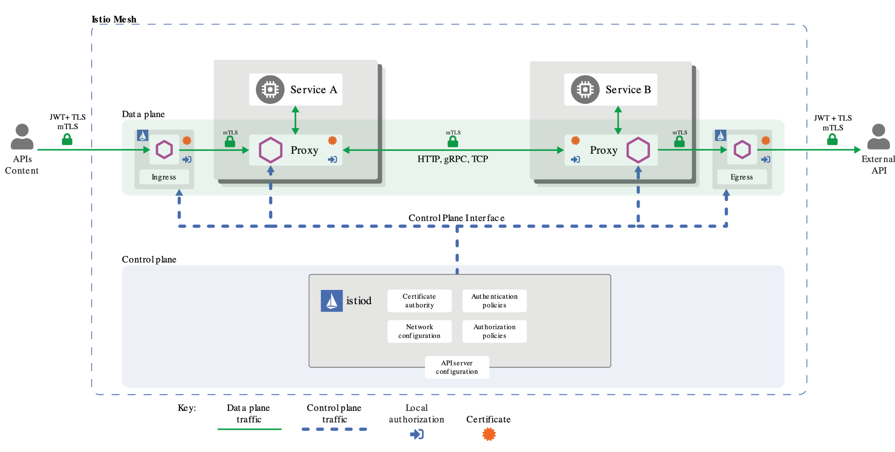
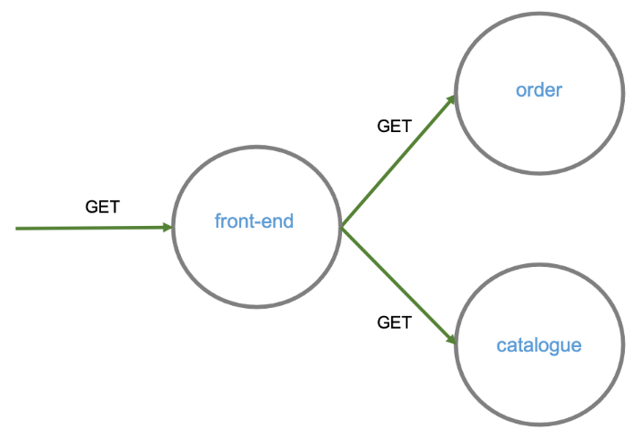

O Istio oferece uma solução de segurança abrangente para resolver problemas, como:

* Defender contra ataques _man-in-the-middle_;
* Fornecer controle de acesso de serviço flexível;
* Determinar quem fez o quê e quando.


Istio [High-level architecture](https://istio.io/latest/docs/concepts/security/#high-level-architecture)

Neste cursos iremos abordar dois aspectos da segurança do Istio: TLS mútuo e autenticação de requisições com JWT.

## TLS mútuo

O Istio faz o túnel da comunicação serviço a serviço por meio dos _proxies_ do lado do cliente e do servidor, que são implementados com Envoy. Quando uma carga de trabalho envia uma solicitação para outra carga de trabalho usando autenticação [TLS mútua](https://istio.io/latest/docs/concepts/security/#mutual-tls-authentication), a solicitação é tratada da seguinte maneira:

1. O Istio redireciona o tráfego de saída de um cliente para o sidecar Envoy local do cliente.

2. O Envoy do lado do cliente inicia um _handshake_ TLS mútuo com o Envoy do lado do servidor. Durante o _handshake_, o Envoy do lado do cliente também faz uma verificação de nomenclatura segura para verificar se a conta de serviço apresentada no certificado do servidor está autorizada a executar o serviço de destino.

3. O Envoy do lado do cliente e o Envoy do lado do servidor estabelecem uma conexão TLS mútua, e o Istio encaminha o tráfego do Envoy do lado do cliente para o Envoy do lado do servidor.

4. Após a autorização, o Envoy do lado do servidor encaminha o tráfego para o serviço do servidor por meio de conexões TCP locais.

O Istio configura automaticamente os _sidecars_ da carga de trabalho para usar TLS mútuo. Por padrão, o Istio configura as cargas de trabalho de destino usando o modo `PERMISSIVE`. Quando o modo PERMISSIVO está habilitado, um serviço pode aceitar tanto texto simples quanto tráfego TLS. Para permitir apenas o tráfego TLS, a configuração precisa ser alterada para o modo `STRICT`.

Vamos verificar isso com ajuda do kiali

<https://[[HOST_SUBDOMAIN]]-20001-[[KATACODA_HOST]].environments.katacoda.com>

Vá para o gráfico (Versioned App graph) e na caixa de seleção _Display_, marque _Security_.

Vocë deverá ver que todas as conexões agora tem um símbolo de cadeado, isso indica que as requisições são seguras (TLS).


### Desabilitando o TLS múto

Você pode utilizar a mesma confiugração para desabilitar o TLS múto, porém isso não é recomendado, a não ser que você implemente sua própria solução.


```
# Desabilitando o MTLS
cat <<EOF | kubectl apply -f -
apiVersion: "security.istio.io/v1beta1"
kind: "PeerAuthentication"
metadata:
  name: "disable-mtls-namespace"
  namespace: "default"
spec:
  mtls:
    mode: DISABLE
EOF
```{{execute}}

Verifique novamente no Kiali, após alguns segundos, os cadeados desapareceram.

Vocë pode desligar o MTLS para toda a malha

```
kubectl apply -n istio-system -f - <<EOF
apiVersion: "security.istio.io/v1beta1"
kind: "PeerAuthentication"
metadata:
  name: "disable-mtls-mesh"
spec:
  mtls:
    mode: DISABLE
EOF
```{{execute}}

> Para excluir a configuração acima `kubectl delete pa/disable-mtls-mesh -n istio-system`

Para voltar para a configuração original, vamos excluir o PeerAuthentication. Veremos mais sobre como controlar o MTLS nas proximas seções.

`kubectl delete PeerAuthentication/disable-mtls-namespace`

#### Desabilitando TLS múto para uma aplicação

Como a maioria das configurações, você pode especificar um seletor para o qual a configuração é válida. Essa configuraçâo pode ser necessária se vocë estiver lidando com aplicações legadas, que não utilizam o protocolo https, vocë poderá desligá-lo temporariamente, até que ela seja refatorada.

```yaml
apiVersion: "security.istio.io/v1beta1"
kind: "PeerAuthentication"
metadata:
  name: "front-end-peer-policy"
  namespace: "default"
spec:
  selector:
    matchLabels:
      app: front-end
  mtls:
    mode: DISABLE
```

Há casos em que você deseja desativar o TLS mútuo para uma porta:

```yaml
apiVersion: "security.istio.io/v1beta1"
kind: "PeerAuthentication"
metadata:
  name: "front-end-workload-policy"
  namespace: "default"
spec:
  selector:
     matchLabels:
       app: front-end
  portLevelMtls:
    8000:
      mode: DISABLE
```

Verifique se sobrou alguma configura configuração e exclua.

Request authentication policy:

```
kubectl apply -f - <<EOF
apiVersion: "security.istio.io/v1beta1"
kind: "RequestAuthentication"
metadata:
  name: "jwt-example"
  namespace: foo
spec:
  selector:
    matchLabels:
      app: httpbin
  jwtRules:
  - issuer: "testing@secure.istio.io"
    jwksUri: "https://raw.githubusercontent.com/istio/istio/release-1.8/security/tools/jwt/samples/jwks.json"
EOF
```{{execute}}

## Bloquear tráfego de saída

Na seção 10.1.5 - Gateways, implementamos um gateway de saída, nesta seção discutiremos um dos motivos para implementá-lo, segurança.

Istio facilita a comunicação intra serviços, as vezes chamada de comunicação [leste-oeste](https://en.wikipedia.org/wiki/East-west_traffic), mas no ponto de vista de segurança, o risco está na comunicação norte-sul, ou seja, tráfico para fora da malha, por exemplo, chamada de APIs na internet.

Por padrão, o Istio não impede a comunicação dos serviços, dentro da malha, chamarem serviços externos, mesmo que não estejam registrados (_ServiceEntry_).

Em versões passadas (anterior a 1.5), o Istio bloqueava o tráfego de saída para fora da malha de serviços por padrão, isso causava alguma confusão entre os desenvolvedores que estão acostumados a acessar serviços externos tais como: APIs, Bancos de Dados, serviços de mensagens, etc.

A decisão de modificar o padrão simplificou as configurações, mas aumentou o risco de segurança, por exemplo, se algum software malicioso, como um minerador de bitcoins, obtver acesso a infraestrutura da sua aplicação, poderá alcançar todos os sistemas que sua aplicação acessa, porém, se você restringir esse acesso, a infra da sua aplicação se torna inútil para o atacante que não conseguirá alcançar a sua infraestrura e enviar os dados processados ou roubados.

Pense nisso quando estiver configurando sua malha de serviços.

Vamos verificar em que modo nossa malha está configurada:

`kubectl get istiooperator installed-state -n istio-system -o jsonpath='{.spec.meshConfig.outboundTrafficPolicy.mode}'`{{execute}}

Vamos instalar um serviço externo e modificar o _deployment_ da order para chamá-lo:

Cria o serviço credit no namespace financial:

`kubectl apply -f istio-curso/exemplos/simul-shop/manifests/10/credit-deployment.yaml`{{execute}}

Serviço externo:

`kubectl apply -f istio-1.8.2/samples/httpbin/httpbin.yaml`{{execute}}

Modificando o order para invocar serviço externo:

`kubectl apply -f istio-curso/exemplos/simul-shop/manifests/10/orders-deployment-external-api.yaml`{{execute}}

> O _namespace_ financial não tem o rótulo do Istio para injeção automática de _sidecar_.

Agora bloquearemos todo o tráfego de saída que não está registrado:

Faremos um novo deploy do istiod com a nova configuração:

`istioctl install --set profile=demo --skip-confirmation --set meshConfig.outboundTrafficPolicy.mode=REGISTRY_ONLY`{{execute}}

Verificando se as configurações foram alteradas:

`kubectl get istiooperator installed-state -n istio-system -o jsonpath='{.spec.meshConfig.outboundTrafficPolicy.mode}'`{{execute}}

Vamos verificar no kiali o que está acontecendo.


Como você pode verificar, o tráfego entre os serviços está OK, mas o tráfego para fora da malha foi bloqueado.

Vamos registrar o serviço bloqueado e tentar novamente.

`kubectl apply -f istio-curso/exemplos/simul-shop/istio/12/httpbin-serviceentry.yaml`{{execute}}

Retorne para o kiali e veja o resultado.

Você notou que o serviço de crédito, embora não tenha um _sidecar_ não teve problema de comunicação, isso porque o Istio cria uma entrada para cada serviço do kubernetes, mas o serviço httpbin.org não têm e foi bloqueado até que fosse criado um [registro](istio-curso/exemplos/simul-shop/istio/12/httpbin-serviceentry.yaml).

Vamos restaurar a configuração ao modo padrão.

Retornndo o flag para o padrão:

`istioctl install --set profile=demo --skip-confirmation --set meshConfig.outboundTrafficPolicy.mode=ALLOW_ANY`{{execute}}

Excluindo a entrada no registro de serviço:

`kubectl delete -f istio-curso/exemplos/simul-shop/istio/12/httpbin-serviceentry.yaml`{{execute}}

Removendo o namespace financial:

`kubectl delete ns financial`{{execute}}

Serviço externo:

`kubectl delete -f istio-1.8.2/samples/httpbin/httpbin.yaml`{{execute}}

Restaurando os deployments:

`kubectl apply -f istio-curso/exemplos/simul-shop/manifests/4`{{execute}}

## Controle de Acesso

Por padrão, todas as solicitações na malha de serviços do Istio são permitidas. Podemos modificar esse comportamento com o recurso _AuthorizationPolicy_ que permite definir políticas para as cargas de trabalho. 

O Istio converte suas _AuthorizationPolicies_ em configurações para os _sidecars_ (istio-proxy) e, nos demais _proxies_ (gateways).

Vamos começar modificando o padrão, [negando autorização](istio-curso/exemplos/simul-shop/istio/12/authorization-policy-deny-all.yaml) para toda a comunicação na malha.

`kubectl apply -f istio-curso/exemplos/simul-shop/istio/12/authorization-policy-deny-all.yaml`{{execute}}

Vá ao kiali e veja como ficou o tráfego.

Vamos permitir o invocações do método GET, para o [_front-end_](istio-curso/exemplos/simul-shop/istio/12/authorization-policy-allow-front-end.yaml) e do _front-end_ para [_orders_](istio-curso/exemplos/simul-shop/istio/12/authorization-policy-allow-orders.yaml) e [_catalogue_](istio-curso/exemplos/simul-shop/istio/12/authorization-policy-allow-catalogue.yaml).



`kubectl apply -f istio-curso/exemplos/simul-shop/istio/12/authorization-policy-allow-front-end.yaml`{{execute}}

`kubectl apply -f istio-curso/exemplos/simul-shop/istio/12/authorization-policy-allow-orders.yaml`{{execute}}

`kubectl apply -f istio-curso/exemplos/simul-shop/istio/12/authorization-policy-allow-catalogue.yaml`{{execute}}

> Você pode aplicar um de cada vez e conferir no kiali a mudança.

Volte para o kiali e verifique como o tráfego está.

Para liberar todo o tráfego novamente, como o padrão, basta excluir a política de negação.

`kubectl delete -f istio-curso/exemplos/simul-shop/istio/12/authorization-policy-deny-all.yaml`{{execute}}

Novamente no kiali, verifique que ao excluir a política, todo o tráfego foi liberado e as demais políticas não tem mais efeito.

Para manter o ambiente limpo, vamos exclui-las também.

`kubectl delete -f istio-curso/exemplos/simul-shop/istio/12/authorization-policy-allow-front-end.yaml`{{execute}}

`kubectl delete -f istio-curso/exemplos/simul-shop/istio/12/authorization-policy-allow-orders.yaml`{{execute}}

`kubectl delete -f istio-curso/exemplos/simul-shop/istio/12/authorization-policy-allow-catalogue.yaml`{{execute}}

O controle de acesso permite de uma forma granular, controlar quem pode acessar o que, isso pode ser necessário em ambientes compartilhados e oferece mais um nível de controle, além do RBAC do kubernetes.
