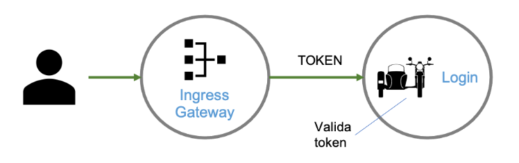

## Políticas de autenticação

### Autenticando o usuário

O Istio utiliza [JSON Web Token (JWT)](https://jwt.io/introduction/) que é um tipo de token de autenticação usado para identificar um usuário para um aplicativo de servidor.

Os JWTs contêm informações sobre o chamador do cliente e podem ser usados como parte de uma arquitetura de sessão do cliente. Um [JSON Web Key Set (JWKS)](https://auth0.com/docs/jwks) contém as chaves criptográficas usadas para verificar os JWTs recebidos.



Adaptamos o exemplo do [Istio](https://istio.io/latest/docs/tasks/security/authentication/authn-policy/#end-user-authentication) e iremos criar nossos próprios certificados.

Vamos definir como chegaremos nos nossos serviços:

```
export INGRESS_HOST=$(kubectl -n istio-system get service istio-ingressgateway -o jsonpath='{.status.loadBalancer.ingress[0].ip}')
export INGRESS_PORT=$(kubectl -n istio-system get service istio-ingressgateway -o jsonpath='{.spec.ports[?(@.name=="http2")].port}')
export SECURE_INGRESS_PORT=$(kubectl -n istio-system get service istio-ingressgateway -o jsonpath='{.spec.ports[?(@.name=="https")].port}')
export TCP_INGRESS_PORT=$(kubectl -n istio-system get service istio-ingressgateway -o jsonpath='{.spec.ports[?(@.name=="tcp")].port}')
```{{execute}}

Obtenha os scripts para criar os certificados e gerar os tokens

Script:

`wget --no-verbose https://raw.githubusercontent.com/istio/istio/release-1.9/security/tools/jwt/samples/gen-jwt.py -P assets/scripts/`{{execute}}

[Opcional] jwkgen. Os cerficiados estão no diretório assets/exemplos/certificados

Para instalar em outros sistemas operacionais acesse: https://github.com/rakutentech/jwkgen

`apt install jwkgen`{{execute}}

### Aplicação

Vamos implemntar o seguinte cenário, a equipe responsável pelo serviço `login` quer expó-lo para fora da malha, mas somente para usuários autenticados.

Verificando a aplicação:

`kubectl get pods -l app=login`{{execute}}

Acessando o serviço usando o front-end:

`kubectl exec "$(kubectl get pod -l app=front-end,version=v1 -o jsonpath={.items..metadata.name})" -c front-end -- curl http://login:8000/ -s -o /dev/null -w "%{http_code}\n"`{{execute}}

```bash
# Output
# 200
```

Acessando os serviços login, catalogue e orders:

```
for service in "login" "catalogue" "orders";
  do kubectl exec "$(kubectl get pod -l app=front-end,version=v1 -o jsonpath={.items..metadata.name})" -c front-end -- curl "http://${service}:8000/" -s -o /dev/null -w " front-end to ${service}: %{http_code}\n"; 
done
```{{execute}}

```bash
# Output
# front-end to login: 200
# front-end to catalogue: 200
# front-end to orders: 200
```

Vamos nos certificar que não há configurações do Istio.

Request auth policy:

`kubectl get requestauthentication --all-namespaces`{{execute}}

Authorization policy:

`kubectl get authorizationpolicy --all-namespaces`{{execute}}

Virtual service:

`kubectl get vs --all-namespaces`{{execute}}

Ingress gateway:

`kubectl get gateway --all-namespaces`{{execute}}

### Configurando o acesso ao login

Iremos configurar um [ingress gateway](https://istio.io/latest/docs/tasks/traffic-management/ingress/) para o login para que possamos aplicar as regras exclusivamente para esse serviço.

Ingress Gateway:

```
kubectl apply -f - <<EOF
apiVersion: networking.istio.io/v1alpha3
kind: Gateway
metadata:
  name: login-gateway
  namespace: default
spec:
  selector:
    istio: ingressgateway # use Istio default gateway implementation
  servers:
  - port:
      number: 80
      name: http
      protocol: HTTP
    hosts:
    - "*"
EOF
```{{execute}}

VirtualService:

```
kubectl apply -f - <<EOF
apiVersion: networking.istio.io/v1alpha3
kind: VirtualService
metadata:
  name: login
  namespace: default
spec:
  hosts:
  - "login.default"
  gateways:
  - login-gateway
  http:
  - route:
    - destination:
        port:
          number: 8000
        host: login.default.svc.cluster.local
EOF
```{{execute}}

Testando:

`http "$INGRESS_HOST:$INGRESS_PORT/" "Host: login.default"`{{execute}}

```bash
# Output
# HTTP/1.1 200 OK
# content-length: 104
# content-type: application/json
# date: Mon, 21 Dec 2020 20:56:18 GMT
# server: istio-envoy
# x-envoy-upstream-service-time: 4

# {
#     "app": "login",
#     "description": "Hi there!",
#     "name": "greetings",
#     "version": "v1",
#     "when": "2020-12-21 20:56:18"
# }
```

### Criando os certificados e configurando JWT

Antes de configurar o Istio para validar tokens, precisamos de certificados. Iremos utilizar uma arquitetura simples, um utilitário irá criar os certificados e um script irá gerar os tokens.

Normalmente essa infraestrutura é mais sofisticada, como o serviço PaaS da [Auth0](https://auth0.com/), mas os elementos são os mesmos.

Vamos criar os certificados:

`jwkgen rsa assets/exemplos/certificates/istio-curso`{{execute}}

Isso irá criar quatro arquivos:

* istio-curso.json - jwks privado
* istio-curso.pem - chave privada
* istio-curso.pub.json - jwks público
* istio-curso.pub.pem - chave pública

Iremos utilizar a chave privada e modificaremos a chave jwks pública, como segue:

```json
{
    "keys": [
        {
            "kid": "yQtcBEoJ-ZvTFdTCxw9WpSnPrh6sHz0WxoEgG1USCYQ",
            "kty": "RSA",
            "n": "yMqQJN53dMD6VEjo0prFbtKdaCKX76ebpJIL4OcXvx5HGeG8tuX6PENnuPc_f3ddnCHVr_Qwx0a6fmCwatxRvwXhf7ClJjs6bo-iEWskD_U-Vbk7Zt7IN94-hnx2oH4nO5DCDmtJrdDd6Gy8vo0iGonOWCtqalwOZg2cG5i7KkU5wNidrtzh81Oocwlk_9-rhOMrEDv5iXk_k4GUNktJjV-1FLNZIZGnMRvehV-xnclyyCMFRIgOSm0mg3tDEgUMEgKTZxwsWt8BrqkmBKorTfxGpbHAkGuujrxHSQDyC_SlrRBn86fVnAIpHOHNVp6sorjo5jXJl0GjXZ3Allw5nw",
            "e": "AQAB"
        }
    ]
}
```

> Para configurar a _RequestAuthentication_ jwks iremos remover as quebras de linhas.

Vamos configurar o Ingress Gateway para validar o token:


```
kubectl apply -f - <<EOF
apiVersion: "security.istio.io/v1beta1"
kind: "RequestAuthentication"
metadata:
  name: jwt-login
  namespace: default
spec:
  selector:
    matchLabels:
      istio: ingressgateway
  jwtRules:
  - issuer: "john@simul-shop.com"
    jwks: |
        {
            "keys": [
                {
                    "kid": "yQtcBEoJ-ZvTFdTCxw9WpSnPrh6sHz0WxoEgG1USCYQ",
                    "kty": "RSA",
                    "n": "yMqQJN53dMD6VEjo0prFbtKdaCKX76ebpJIL4OcXvx5HGeG8tuX6PENnuPc_f3ddnCHVr_Qwx0a6fmCwatxRvwXhf7ClJjs6bo-iEWskD_U-Vbk7Zt7IN94-hnx2oH4nO5DCDmtJrdDd6Gy8vo0iGonOWCtqalwOZg2cG5i7KkU5wNidrtzh81Oocwlk_9-rhOMrEDv5iXk_k4GUNktJjV-1FLNZIZGnMRvehV-xnclyyCMFRIgOSm0mg3tDEgUMEgKTZxwsWt8BrqkmBKorTfxGpbHAkGuujrxHSQDyC_SlrRBn86fVnAIpHOHNVp6sorjo5jXJl0GjXZ3Allw5nw",
                    "e": "AQAB"
                }
            ]
        }
EOF
```{{execute}}

Vamos testa-lo.

Sem token:

`http "$INGRESS_HOST:$INGRESS_PORT/" "Host: login.default"`{{execute}}

```bash
# Output
# HTTP/1.1 200 OK
# content-length: 104
# content-type: application/json
# date: Mon, 21 Dec 2020 21:20:59 GMT
# server: istio-envoy
# x-envoy-upstream-service-time: 4

# {
#     "app": "login",
#     "description": "Hi there!",
#     "name": "greetings",
#     "version": "v1",
#     "when": "2020-12-21 21:20:59"
# }
```

Token inválido:

`http "$INGRESS_HOST:$INGRESS_PORT/" "Authorization: Bearer ItsNotAToken" "Host: login.default"`{{execute}}

```bash
# Output
# HTTP/1.1 401 Unauthorized
# content-length: 79
# content-type: text/plain
# date: Mon, 21 Dec 2020 21:20:04 GMT
# server: istio-envoy

# Jwt is not in the form of Header.Payload.Signature with two dots and 3 sections
```

Token válido:

`TOKEN=$(python3 assets/scripts/gen-jwt.py -iss john@simul-shop.com assets/exemplos/certificates//istio-curso.pem --expire 20)`{{execute}}

`http "$INGRESS_HOST:$INGRESS_PORT/" "Authorization: Bearer $TOKEN" "Host: login.default"`{{execute}}

```bash
# 200
```

> **Dica pro**: Em [jwt.io](https://jwt.io) você pode verificar o token criado. Copie o token (`echo $TOKEN`) e cole no _Debugger_ do JWT.io.

O Ingress Gateway do Istio já está validando o token, porém ele ainda aceita que os serviços sejam chamados sem um token.

Vamos modificar essa configuração.

## Exigindo um token válido

Para rejeitar solicitações sem tokens válidos, adicione uma política de autorização com uma regra especificando uma ação _DENY_ para solicitações sem principais de solicitação, mostrado como notRequestPrincipals: ["*"] no exemplo a seguir. Os principais de solicitação estão disponíveis apenas quando tokens JWT válidos são fornecidos. A regra, portanto, nega solicitações sem tokens válidos.

```
kubectl apply -f - <<EOF
apiVersion: "security.istio.io/v1beta1"
kind: "AuthorizationPolicy"
metadata:
  name: login-ingress
  namespace: default
spec:
  selector:
    matchLabels:
      istio: ingressgateway
  action: DENY
  rules:
  - from:
    - source:
        notRequestPrincipals: ["*"]
EOF
```{{execute}}

Vamos testar chamar novamente o serviço sem um token.

Caminho protegido:

`http "$INGRESS_HOST:$INGRESS_PORT/" "Host: login.default"`{{execute}}

```bash
# Output
# HTTP/1.1 403 Forbidden
# content-length: 19
# content-type: text/plain
# date: Mon, 21 Dec 2020 21:05:43 GMT
# server: istio-envoy

# RBAC: access denied
```

Agora com um token válido:

Gerando o token

`TOKEN=$(python3 assets/scripts/gen-jwt.py -iss john@simul-shop.com assets/exemplos/certificates//istio-curso.pem --expire 20)`{{execute}}

Invocando com um token válido:

`http "$INGRESS_HOST:$INGRESS_PORT/" "Authorization: Bearer $TOKEN" "Host: login.default"`{{execute}}

```bash
# Output
# HTTP/1.1 200 OK
# content-length: 104
# content-type: application/json
# date: Mon, 21 Dec 2020 21:18:29 GMT
# server: istio-envoy
# x-envoy-upstream-service-time: 4

# {
#     "app": "login",
#     "description": "Hi there!",
#     "name": "greetings",
#     "version": "v1",
#     "when": "2020-12-21 21:18:33"
# }
```

## Requerendo token válido por caminho

Para refinar a autorização com um requisito de token por host, caminho ou método, altere a política de autorização.

Nesse cenário, apenas o caminho _healthz_ deve ser protegido por um token. Vamos modificar a configuração.

```
kubectl apply -f - <<EOF
apiVersion: "security.istio.io/v1beta1"
kind: "AuthorizationPolicy"
metadata:
  name: login-ingress
  namespace: default
spec:
  selector:
    matchLabels:
      istio: ingressgateway
  action: DENY
  rules:
  - from:
    - source:
        notRequestPrincipals: ["*"]
    to:
    - operation:
        paths: ["/healthz"]
EOF
```{{execute}}

Agora você pode chamar o caminho raíz sem token:

`http "$INGRESS_HOST:$INGRESS_PORT/" "Host: login.default"`{{execute}}

Mas ao tentar chamar o caminho protegido:

Caminho protegido:

`http "$INGRESS_HOST:$INGRESS_PORT/healthz" "Host: login.default"`{{execute}}

```bash
# Output
# HTTP/1.1 403 Forbidden
# content-length: 19
# content-type: text/plain
# date: Mon, 21 Dec 2020 21:15:15 GMT
# server: istio-envoy

# RBAC: access denied
```

Vamos adicionar um token válido:

Gerando o token

`TOKEN=$(python3 assets/scripts/gen-jwt.py -iss john@simul-shop.com assets/exemplos/certificates//istio-curso.pem --expire 20)`{{execute}}

Invocando:

`http "$INGRESS_HOST:$INGRESS_PORT/healthz" "Authorization: Bearer $TOKEN" "Host: login.default"`{{execute}}

```bash
# Output
# HTTP/1.1 200 OK
# content-length: 98
# content-type: application/json
# date: Mon, 21 Dec 2020 21:17:27 GMT
# server: istio-envoy
# x-envoy-upstream-service-time: 4

# {
#     "app": "login",
#     "description": "health",
#     "name": "status",
#     "version": "v1",
#     "when": "2020-12-21 21:17:28"
# }
```

### Considerações

A comunicação com o serviço através do ingress gateway foi protegida, porém, a comunicação dentro da malha não exige um token para autenticar o usuário e pode ser acessado por todos os serviços.

```
for service in "login" "catalogue" "orders";
  do kubectl exec "$(kubectl get pod -l app=front-end -o jsonpath={.items..metadata.name})" -c front-end -- curl "http://${service}:8000/" -s -o /dev/null -w " front-end to ${service}: %{http_code}\n"; 
done
```{{execute}}

```bash
# Output
# front-end to login: 200
# front-end to catalogue: 200
# front-end to orders: 200
```

## Autorizando acesso a um serviço (RBAC)

```
cat <<EOF | kubectl apply -f -
apiVersion: security.istio.io/v1beta1
kind: AuthorizationPolicy
metadata:
  name: login-ingress
  namespace: default
spec:
  selector:
    matchLabels:
      app: login
  action: ALLOW
  rules:
  - from:
    - source:
       requestPrincipals: ["john@simul-shop.com/john@simul-shop.com"] # iss / sub
    when:
    - key: request.auth.claims[role]
      values: ["customer"]
EOF
```{{execute}}

Somente usuários com um token válido e o papel _customer_ terão acesso ao serviço.


`TOKEN=$(python3 assets/scripts/gen-jwt.py -claim role:customer -iss john@simul-shop.com assets/exemplos/certificates//istio-curso.pem --expire 20)`{{execute}}

`http "$INGRESS_HOST:$INGRESS_PORT/healthz" "Authorization: Bearer $TOKEN" "Host: login.default"`{{execute}}

Copie o token gerado para decodifica-lo em [jwt.io](jwt.io). Se quiser validar o token, utilize a [chave pública](assets/exemplos/certificates/istio-curso.pub.pem).


## Limpando as configurações

Vamos remover o que criamos e recapitular.

1. Criamos um _gateway_ para o `login`
2. Configuramos um _VirtualService_ o que o expos em `http://$INGRESS_HOST:$INGRESS_PORT/`
3. Configuramos uma política (RequestAuthentication) para validar o token
4. E uma política (AuthorizationPolicy) para negar qualquer acesso que não tivesse um token válido

Agora removeremos as configurações:

Authentication policy:

`kubectl delete requestauthentication/jwt-login`{{execute}}

Authorization policy:

`kubectl delete authorizationpolicy/login-ingress`{{execute}}

Virtual service:

`kubectl delete vs/login`{{execute}}

Ingress gateway:

`kubectl delete gateway/login-gateway`{{execute}}

Agora estamos prontos para a próxima seção.

## Conclusão

O Istio por padrão é muito seguro, mas como as demais funcionalidades, fornecem parâmtros paraadequar as suas necessidades. Se você tiver algum problema configurando segurança no Istio acesse [Security Problems](https://istio.io/latest/docs/ops/common-problems/security-issues/).
