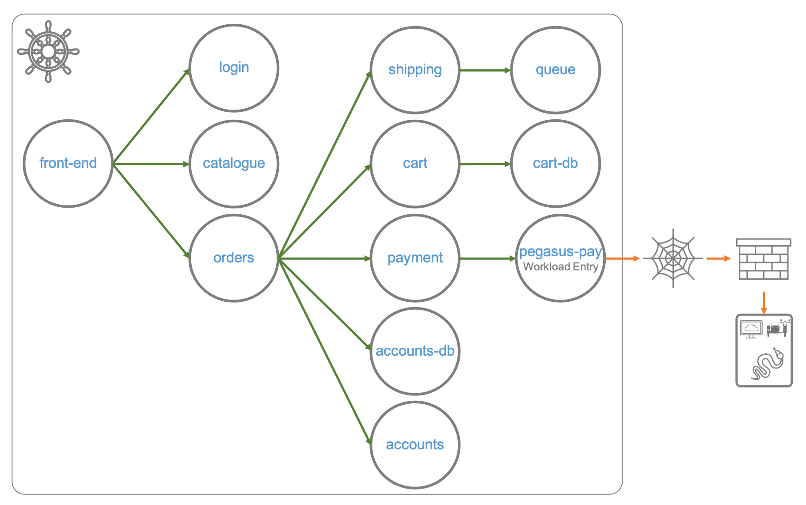

Executar serviços em contêineres adicionam muitos benefícios, tasi como escalonamento automático, isolamento de dependência e otimização de recursos. Adicionar o Istio ao seu ambiente Kubernetes pode simplificar radicalmente a agregação de métricas e o gerenciamento de políticas, principalmente se você estiver operando muitos contêineres.

Mas como ficam os aplicativos legados em máquinas virtuais? Ou se você estiver migrando de VMs para contêineres?

Embora contêineres e Kubernetes sejam amplamente usados, ainda há muitos serviços implantados em máquinas virtuais e APIs fora do cluster Kubernetes que precisam ser gerenciados pela malha do Istio. É um grande desafio unificar a gestão dos ambientes [_brownfield_](https://en.wikipedia.org/wiki/Brownfield_(software_development)) e [_greenfield_](https://en.wikipedia.org/wiki/Greenfield_project).

Você ja conhece muitos recursos do Istio e sabe que podemos acessar serviços que estão fora da malha registrando-os com o _ServiceEntry_, então P\por que instalar o Istio em uma máquina virtual?

O _ServiceEntry_ habilita serviços dentro da malha para descobrir e acessar serviços externos e a gerenciar o tráfego para esses serviços externos. Em conjunto com o _VirtualService_ configura regras de acesso para o serviço externo, tais como tempo limite de solicitação, injeção de falha, etc.

Porém, esse recurso controla apenas o tráfego do lado do cliente. A implantação de _sidecars_ em máquinas virtuais e a configuração das carga de trabalho para o kubernetes, permite que ela seja gerenciada como um POD e o gerenciamento de tráfego aplicado uniformemente em ambis os lados.

Neste cenário, nosso sistema de pagamanetos necessita integrar-se com um ERP legado para enviar os pagamentos realizados. Este sistema está em execução em uma máquina virtual.

Para simular este legado, iremos criar uma VM e executar o script python que usamos no generic-services.

A arquitetura da solução ficará assim:



## Configuração

Antes de iniciarmos as configurações no Kubernetes e Istio, precisamos colocar nosso sistema legado em operação, para isso você precisará de um host.

Crie uma VM em um provedor de nuvem da sua escolha, lembre-se de que ela precisa ser acessível pela internet, configure a política de segurnaça para permitir que sua máquina acesse a VM nas portas 22 (ssh) e da aplicação (8000).

Iremos utilizar uma VM na nuvem, mas a diferença é como criar a vm, os demias passos são os mesmos.

### Criando uma VM

Não há uma maneira única de criar uma VM, depende do provedor de nuvem ou do software de virtualização que você escolher, o que precisamos é de um IP que o cluster de kubernetes consiga alcançar.

Crie a VM onde for mais conveniente, ela pode ser o menor tamanho possível, utilize cotas gratuítas das nuvens.

Nossa VM foi criada na Azure e abrimos as portas 22 (ssh), 8000 (aplicação) e ICMP (protocolos para diagnósticos de rede)

> **Dica pro**: Em ambientes de produção não é recomendado abrir portas como a 22 e ICMP, pelo menos não para qualquer origem e é recomendado colocar a(s) máquina(s) atrás de um balanceador de carga e registrar o IP em um DNS.

Vamos testar a conectividade do cluster:

Verificando conectividade:

`VM_ADDRESS=10.240.0.115 # Usando o IP interno, o mesmo da subnet do cluster k8s`{{execute T2}}

`kubectl exec -it svc/payment -c payment -- ping -c 5 $VM_ADDRESS`{{execute T2}}

Para simplificar, instalamos docker na VM e executaremos o nosso aplicativo usando a imagem do generic-services. Para mais informações de como instalar docker no seu sistema operacional [Install Docker Engine](https://docs.docker.com/engine/install/).

> Se você instalar docker em linux provavelmente precisará ajustar as permissões do usuário. Acesse [Post-installation steps for Linux](https://docs.docker.com/engine/install/linux-postinstall/)

Criaremos um diretório de trabalho:

`mkdir -p "${WORK_DIR}"`{{execute T1}}

E vamos definir as variáveis para acesso a VM. Preencha com os valores da sua VM. Ela deve ser acessível via internet.

```
VM_PUB_ADDRESS="pegasus.eastus.cloudapp.azure.com"
VM_APP="pegasus-pay"
VM_NAMESPACE="legacy"
WORK_DIR="bkp/vmintegration"
SERVICE_ACCOUNT="legacy-pegasus"
VM_USER="peguser"
VM_PKEY_PATH="bkp/pegasus_key.pem"
```

Abriremos uma sessão de ssh para a VM:

`ssh -i $VM_PKEY_PATH $VM_USER@$VM_PUB_ADDRESS"`{{execute T2}}

E executaremos o comando docker para iniciar nossa aplicação:

```
# pegasus-pay API
docker run -d --rm \
-p 8000:8000 \
--hostname pegasus-pay \
--name pegasus-pay \
-e SCHED_CALL_URL_LST=http://localhost:8000/healthz \
-e SCHED_CALL_INTERVAL=300 \
-e APP=pegasus-pay \
-e VERSION=v1 \
kdop/generic-service:0.0.5
```{{execute T2}}

Logs (CTRL+C para sair)

`docker logs -f pegasus-pay`{{execute T2}}

Vamos verificar a conectividade e o serviço.

Verificando firewall e serviço:

`SVC_PORT=8000`{{execute T1}}

`kubectl exec -it svc/payment -c payment -- curl http://$VM_ADDRESS:$SVC_PORT`{{execute T1}}

Deixaremos o serviço em execução no segundo plano e faremos mais configurações.

### Instalando ou modificando a instalação o Istio

Você já fez isso antes neste curso, mas agora iremos modificar a instalação para registrar as VMs automaticamente.

No nosso cluster (terminal 1):

`istioctl install --set values.pilot.env.PILOT_ENABLE_WORKLOAD_ENTRY_AUTOREGISTRATION=true --skip-confirmation`{{execute T1}}

Deploy do gateway:

`istio-1.8.2/samples/multicluster/gen-eastwest-gateway.sh --single-cluster | istioctl install -y -f -`{{execute T1}}

Expondo o gateway com um serviço de LoadBalancer:

`kubectl apply -f istio-1.8.2/samples/multicluster/expose-istiod.yaml`{{execute T1}}

Verificando o que foi criado:

`kubectl get pods,dr,vs,gw -n istio-system`{{execute T1}}

Verifique o endereço e as portas expostas pelo `gateway/istio-eastwestgateway`, usaremos esses dados para a comunicação da VM com o cluster.

`kubectl get svc -n istio-system`{{execute T1}}

### Configurando o namespace para a VM

As VMs serão registradas em um _namespace_, iremos criá-lo e associar uma conta de serviço.

Namespace:

`kubectl create namespace "${VM_NAMESPACE}"`{{execute T1}}

ServiceAccount:

`kubectl create serviceaccount "${SERVICE_ACCOUNT}" -n "${VM_NAMESPACE}"`{{execute T1}}

### Criando os arquivos e transferindo para a VM

Para configurar o Envoy na VM, o `istioctl` fornece um utilitário que permite criar o [WorkloadGroup](https://istio.io/latest/docs/reference/config/networking/workload-group/) e os arquivos de configuração, token e certificado que são utiliza para configurar o Envoy na VM.

Crie um modelo de WorkloadGroup para as VMs:

`istioctl x workload group create --name "${VM_APP}" --namespace "${VM_NAMESPACE}" --labels app="${VM_APP}" --serviceAccount "${SERVICE_ACCOUNT}" > workloadgroup.yaml`{{execute T1}}

Cria os arquivos para configuração:

* `cluster.env`: Contém metadados que identificam qual namespace, conta de serviço, rede CIDR e (opcionalmente) quais portas de entrada capturar.
* `istio-token`: um token do Kubernetes usado para obter certificados da CA.
* `mesh.yaml`: fornece metadados adicionais do Istio, incluindo nome de rede, domínio confiável e outros valores.
* `root-cert.pem`: O certificado raiz usado para autenticação.
* `hosts`: Um adendo ao arquivo `/etc/hosts` que o proxy usará para alcançar istiod para.

Criando os arquivo em WORK_DIR:

`istioctl x workload entry configure -f workloadgroup.yaml -o "${WORK_DIR}"`{{execute T1}}

Aplicando o template no cluster:

`kubectl apply -f workloadgroup.yaml`{{execute T1}}

Verificando o que foi criado:

`ls -l $WORK_DIR`{{execute T1}}

## Configurando a VM

Nesta etápa iremos configurar a VM.

> **Dica pro**: Fora do escopo deste curso, idealmente você deve ter um script para automatizar essas etapas para cada nova VM criada que fará parte da malha.

Transferindo os arquivos para a VM:

`scp -i $VM_PKEY_PATH $WORK_DIR/* $VM_USER@$VM_PUB_ADDRESS:/home/$VM_USER`{{execute T1}}

Abriremos o terminal 2 para a sua máquina virtual.

Instalando o certificado root:

`sudo mkdir -p /etc/certs`{{execute T2}}

`sudo cp /home/$VM_USER/root-cert.pem /etc/certs/root-cert.pem`{{execute T2}}

Instalando o token:

`sudo mkdir -p /var/run/secrets/tokens`{{execute T2}}

`sudo cp /home/$VM_USER/istio-token /var/run/secrets/tokens/istio-token`{{execute T2}}

Instalando a configuração cluster.env:

`sudo cp /home/$VM_USER/cluster.env /var/lib/istio/envoy/cluster.env`{{execute T2}}

Instalando a configuração mesh.yaml:

`sudo cp /home/$VM_USER/mesh.yaml /etc/istio/config/mesh`{{execute T2}}

Ajustando permissões:

`sudo mkdir -p /etc/istio/proxy`{{execute T2}}

`sudo chown -R istio-proxy /var/lib/istio /etc/certs /etc/istio/proxy /etc/istio/config /var/run/secrets /etc/certs/root-cert.pem`{{execute T2}}

Adicionando o endereço do LoadBalancer do gateway/istio-eastwestgateway no /etc/hosts:

`sudo -- sh -c "cat /home/peguser/hosts >> /etc/hosts" # TODO: Não funciona adicionar manualmente`{{execute T2}}

> **Dica pro**: O objetivo desse comando é resolver o nome do serviço de descobert do Istio (discoveryAddress). Em produção, não adicione entradas no `/etc/hosts`, registre o endereço em um DNS e utilize o registro. Se não for possível, certifique-se de que o endereço atribuído ao balanceador de carga não mudará.

Instando o sidecar (Linux):

`curl -LO https://storage.googleapis.com/istio-release/releases/1.8.2/deb/istio-sidecar.deb`{{execute T2}}

`sudo dpkg -i istio-sidecar.deb`{{execute T2}}

> Nesta versão, o Istio suporta apenas os sistemas operacionais Linux baseados em centos e debian.

Inicia o sidecar:

`sudo systemctl start istio`{{execute T2}}

Habilita a inicialização automática do sidecar após o boot:

`sudo systemctl enable istio`{{execute T2}}

### Verificando o funcionamento do _sidecar_

Verifica os logs em /var/log/istio/istio.log:

`tail /var/log/istio/istio.log`{{execute T2}}

Os logs não devem exibir erros, e devem se parecer com este:

```bash
2020-12-26T14:48:26.699574Z	info	cache	GenerateSecret from file ROOTCA
2020-12-26T14:48:26.699958Z	info	sds	resource:ROOTCA pushed root cert to proxy
2020-12-26T14:48:26.700180Z	info	sds	resource:default new connection
2020-12-26T14:48:26.700215Z	info	sds	Skipping waiting for gateway secret
2020-12-26T14:48:26.700370Z	info	cache	adding watcher for file ./etc/certs/cert-chain.pem
2020-12-26T14:48:26.700396Z	info	cache	GenerateSecret from file default
2020-12-26T14:48:26.700582Z	info	sds	resource:default pushed key/cert pair to proxy
2020-12-26T15:18:33.664500Z	info	xdsproxy	disconnected from XDS server: istiod.istio-system.svc:15012
2020-12-26T15:18:34.115504Z	info	xdsproxy	Envoy ADS stream established
2020-12-26T15:18:34.115625Z	info	xdsproxy	connecting to upstream XDS server: istiod.istio-system.svc:15012
```

Os erros que encontramos durante a instalação:

* Conexão recusada ou tempo de espera esgotado: Verifique a conectividade a VM com o serviço do ingress. Execute o comando `kubectl get svc -n istio-system`, procure o endereço externo do serviço `istio-egressgateway` e execute comandos de `telnet` ou `netcat` com o endereço e portas. Exemplo: `telnet 52.150.37.127 15012` deve retornar sucesso `Connected to 52.150.37.127.`.
* Erro de validação de token ou certificados - Verifique se os arquivos criados na pasta vmintegration foram corretamente copiados para a VM e copiados para os diretório. Caso necessário pare o serviço do istio na VM, repita o processo e inicie o serviço novamente.
* [TODO] Erro de conexão TLS: Não aparce nos logs. Foi necessário desligar o TLS múto para o namespace `legacy` para conexão Cluster -> VM, o caminho inverso não tem problema.

Para verificar a conectividade da máquina virtual, execute o seguinte comando:

`curl localhost:15000/clusters | grep payment`{{execute T2}}

Vamos enviar requisições para os serviços no cluster:

`curl -s payment.default.svc:8000/`{{execute T2}}

`curl -s "front-end.default.svc:8000/r?code=404&wait=1s"`{{execute T2}}

### Conectando os serviços do cluster aos da VM

Conseguimos consumir serviços do cluster desde a VM, agora vamos configurar o cluster para consumir os serviços na VM.

Como instalamos o Istio com o parâmetro de criação automática de [WorkLoadEntry](https://istio.io/latest/docs/reference/config/networking/workload-entry/), a nossa VM já foi registrada, podemos verificar:

`kubectl get workloadentry.networking.istio.io -A`{{execute T1}}

Você pode configurar qualquer endereço que o cluster consiga chegar na VM, verificamos que o autoregistro do Istio escolheu o endereço privado.

Se o Istio não estiver configurado para autogegistrar as VMs ou se você deseja configurá-los em um _pipeline_, por exemplo, basta escrever e aplicar no cluster a configuração abaixo.

`echo "Interno: $VM_ADDRESS"`{{execute T1}}

`echo "Público: $VM_PUB_ADDRESS"`{{execute T1}}

[Opcional] Se o autoregistro estiver desligado

```
cat <<EOF | kubectl -n legacy apply -f -
apiVersion: networking.istio.io/v1beta1
kind: WorkloadEntry
metadata:
  name: "pegasus-pay"
  namespace: "legacy"
spec:
  address: "$VM_ADDRESS"
  labels:
    app: pegasus-pay
  serviceAccount: "legacy-pegasus"
EOF
```{{execute T1}}

A configuração a seguir registrar um serviço kubernetes para a nossa VM, dessa forma os demais serviços poderão acessá-la como qualquer outro serviço:

```
cat <<EOF | kubectl -n legacy apply -f -
apiVersion: v1
kind: Service
metadata:
  name: pegasus-pay
  labels:
    app: pegasus-pay
spec:
  ports:
  - port: 8000
    name: http-vm
    targetPort: 8000
  selector:
    app: pegasus-pay
EOF
```{{execute T1}}

Acessando o serviço da VM pelo cluster:

`kubectl exec -it svc/payment -c payment -- curl pegasus-pay.legacy.svc.cluster.local:8000`{{execute T1}}

#### TLS mutuo

Ao executar o comando acima retornou o erro:

`upstream connect error or disconnect/reset before headers. reset reason: connection failure`

Vamos desabilitar o TLS mútuo para o _namespace_

```
cat <<EOF | kubectl apply -f -
apiVersion: "security.istio.io/v1beta1"
kind: "PeerAuthentication"
metadata:
  name: "disable-mtls-legacy"
  namespace: "legacy"
spec:
  mtls:
    mode: DISABLE
EOF
```{{execute T1}}

> Desabilitando o MTLS para o namesapce legacy. Solução de contorno para comunicação Cluster -> VM (TODO)
> Para restaurar o TLS mútuo: `kubectl delete peerauthentication.security.istio.io/disable-mtls-legacy -n legacy`

E executar o teste novamente:

`kubectl exec -it svc/payment -c payment -- curl pegasus-pay.legacy.svc.cluster.local:8000`{{execute T1}}

### Monitorando a VM

TODO

Inicie o kiali e jaeger.

Abra um terminal e execute o comando algumas vezes.

`kubectl exec -it svc/payment -c payment -- bash`{{execute T3}}

```
for i in $(seq 1 10);
do curl pegasus-pay.legacy.svc.cluster.local:8000;
done
```{{execute T3}}

Conecte um terminal a VM e execute o comando abaixo algumas vezes.

`for i in $(seq 1 100); do curl payment.default.svc.cluster.local:8000; done`{{execute T2}}

Para que o kiali represente corretamente o serviço.

```
cat <<EOF | kubectl apply -f -
apiVersion: networking.istio.io/v1alpha3
kind: ServiceEntry
metadata:
  name: pegasus-pay
  namespace: legacy
spec:
  hosts:
  - pegasus-pay.legacy
  location: MESH_INTERNAL
  ports:
  - number: 8000
    name: http
    protocol: HTTP
  resolution: DNS
EOF
```{{execute T1}}

`kubectl get se/pegasus-pay -n legacy`{{execute T1}}

## Limpando o ambiente

Esta é a última seção do curso, então não se esqueça de remover todos os recursos criados, principalmente se houver algum custo associado.

> A exclusão dos recursos abaixo só é necessário se você não excluir a VM e o cluster.

```
# Na VM
#Parando Istio:
sudo systemctl stop istio

# Remove a instalação do sidecar
sudo dpkg -r istio-sidecar
dpkg -s istio-sidecar
```{{execute T2}}

```
# No cluster
# Namespace legacy
kubectl delete ns legacy

# Deploys do istio para simul-shop
kubectl delete -f assets/exemplos/simul-shop/istio/

# Deploys do simul-shop
kubectl delete -f assets/exemplos/simul-shop/manifests/

# Istio
kubectl delete namespace istio-system
```{{execute T1}}
